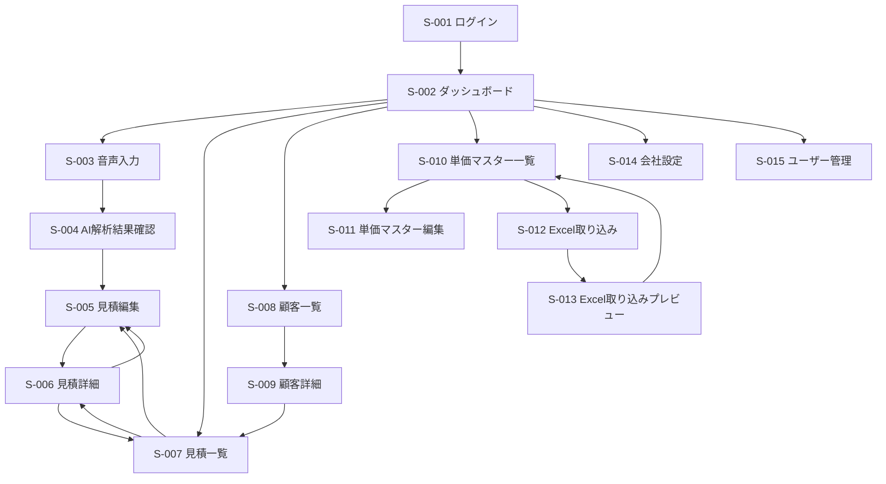

# 音声AI見積作成システム UI/UX設計案

## ユーザー別主要導線

### 現場担当者

現場担当者は、スマートフォンで「聞いた内容をすばやく残し、AIの候補を確認して見積の下書きまで作る」ことを主目的とする。

1. ログイン
2. ダッシュボードの「音声で見積作成」をタップ
3. 音声入力またはテキスト入力
4. 文字起こし結果を確認、必要に応じて修正
5. AI解析結果で場所、品目候補、数量、単価マスター候補、備考候補、業者指示事項候補、確認事項を確認
6. 「見積に反映」を実行
7. 見積編集画面で最低限の不足項目を入力
8. 下書き保存、またはPDF共有

現場では片手操作、屋外利用、移動中の短時間確認が多いため、主要操作は画面下部の固定アクションに集約する。入力より確認を優先し、AIが補完した内容や不明点は目立つ位置に出す。

### 営業担当者

営業担当者は、現場入力から顧客提出用の見積に整えることを主目的とする。

1. 見積一覧または顧客詳細から対象見積を開く
2. 見積編集画面で件名、見積日、有効期限、担当者を確認
3. 明細入力用の短い音声入力または手入力で見積明細候補を作成する
4. 明細の場所、品目、数量、単位、単価、金額、備考、業者指示事項を確認
5. 値引き行、諸経費行、顧客向け備考を追加
6. 業者指示事項を必要に応じて登録
7. PDFプレビューで顧客表示内容を確認
8. PDF出力またはExcel出力
9. ステータスを提出済みに変更

営業担当者向けには、金額の根拠、単価マスターとの一致度、PDFに出る情報と出ない情報の区別を明確にする。打ち合わせ録音は別オプションとし、有効化された会社のみ導線を表示する。

### 事務担当者

事務担当者は、PCで複数見積やマスター情報を効率的に整えることを主目的とする。

1. ダッシュボードで未確認のAI解析結果、下書き見積、提出待ち見積を確認
2. 見積一覧で担当者、ステータス、日付で絞り込み
3. 見積編集画面で明細、金額、備考を整備
4. 顧客マスターの不足情報を補完
5. 単価マスターを検索、編集
6. Excel取り込みで単価マスターを更新
7. 出力結果を確認し、必要に応じて担当者へ差し戻し

PCでは一覧、検索、表形式編集、差分確認を重視する。スマートフォンより情報量を増やし、見積・顧客・単価を横断して確認できる構成にする。

### 管理者・経営者

管理者・経営者は、会社設定、ユーザー、単価、見積状況を管理することを主目的とする。

1. PC管理画面にログイン
2. ダッシュボードで見積件数、提出済み、受注、失注、未確認件数を確認
3. 会社情報、ロゴ、標準備考、振込先を設定
4. ユーザーの追加、編集、停止、権限設定
5. 単価マスターの登録、編集、Excel取り込み
6. 見積一覧から案件状況を確認

管理者には、誤操作防止と権限境界の明示が必要である。削除や一括上書きには確認ダイアログを設ける。

## 画面遷移

### 全体遷移

### スマートフォン導線

スマートフォンでは、下部ナビゲーションを「ホーム」「音声入力」「見積」「顧客」「設定」に絞る。現場入力の最短導線として、ホーム中央に大きな「音声で見積作成」ボタンを配置する。

- ホームから1タップで音声入力へ遷移する。
- 音声入力後は、文字起こし確認、AI解析結果確認、見積編集の順でウィザード型に進める。
- 各画面に「下書き保存」を常時表示し、途中離脱しても再開できる。
- PDF出力後はスマートフォン標準の共有導線を使いやすい位置に置く。

### PC導線

PCでは、左サイドバーに「ダッシュボード」「見積」「顧客」「単価マスター」「Excel取り込み」「会社設定」「ユーザー管理」を配置する。検索と一覧を起点に詳細、編集へ進む管理画面型の構成にする。

- ダッシュボードから未確認AI解析結果、下書き見積、提出待ち見積へ遷移できる。
- 見積一覧、顧客一覧、単価マスター一覧はフィルター条件を保持する。
- 一覧から詳細を開いた後、戻る操作で元の検索条件とスクロール位置を維持する。
- Excel取り込みは、アップロード、列マッピング、プレビュー、実行、結果確認のステップ表示にする。

## スマホ音声入力画面

### 目的

現場担当者が、顧客から聞いた内容をその場で音声またはテキストとして残し、見積作成の入口にできる画面とする。

### レイアウト

- 画面上部に案件の仮タイトル、保存状態、戻る操作を表示する。
- 中央に録音状態を示す大きな録音ボタンを配置する。
- 録音中は経過時間、音量レベル、停止ボタンを明確に表示する。
- 録音後は「再生」「再録音」「文字起こしへ進む」を表示する。
- 画面下部に固定アクションとして「下書き保存」「次へ」を配置する。
- 音声入力が難しい環境向けに「テキストで入力」タブを用意する。

### 入力補助

- 音声入力前に、短いヒントとして「場所、品目、数量、備考、業者指示事項を話す」程度の入力ガイドを表示する。単位は単価マスターに紐づくため、AI入力対象として案内しない。
- 長時間録音による失敗を避けるため、推奨録音時間を表示する。
- 通信状態が悪い場合は、送信前に警告し、再試行できるようにする。
- 文字起こし結果は編集可能なテキストエリアで表示し、専門用語の誤認識をすぐ直せるようにする。

### 状態設計

- 未録音: 録音開始ボタンを主操作にする。
- 録音中: 停止操作のみを強調し、誤タップを避ける。
- 録音完了: 再録音、文字起こし送信、下書き保存を選べる。
- 文字起こし中: 進捗表示とキャンセル不可の説明を出す。
- 文字起こし完了: 編集してAI解析へ進める。
- エラー: 音声データは保持し、再送信またはテキスト入力へ切り替えられるようにする。

## AI解析結果確認画面

### 目的

AIの解析結果を見積へ反映する前に、人間が確認、修正、採用可否を判断する画面とする。AI結果は候補であり、確定情報ではないことを画面上で明示する。

### 構成

- 解析サマリー: 入力内容の要約、作業概要、入力元、音声品質を表示する。顧客名、現場住所、件名案などのヘッダー情報候補は表示しない。
- 見積明細候補: 場所、品目候補、数量、単価マスター候補、マスター単位、マスター単価、備考、単価マスター一致度を表形式で表示する。
- 確認事項: 不足情報やあいまいな内容をチェックリストとして表示する。
- 業者指示事項候補: 顧客には見せない内部・協力業者向けメモとして別枠で表示する。
- 文字起こし原文: 折りたたみ領域で確認できるようにする。

### 操作

- 候補行ごとに「採用」「編集」「除外」を選べる。
- 音声内容から推測された単価マスター品目候補が複数ある場合は、候補ドロップダウンで選択できる。
- 単価マスター品目を選択すると、その品目に紐づく単位と単価を明細へ初期反映する。
- AIが補完または推測した数量、品目候補、備考候補は、補完ラベルを付ける。単位はAI補完対象にせず、単価マスター由来として表示する。
- 確認事項は「確認済み」「後で確認」「不要」に分類できる。
- 「見積に反映」ボタンは、最低限の必須項目が揃うまで非活性にする。

### 表示ルール

- AIが生成した金額は参考値であり、最終金額は単価マスターとユーザー確認で決まることを表示する。
- 単価マスターに一致しない品目は警告色で表示し、手入力単価として扱う。
- 顧客、件名、見積日、有効期限、担当者、顧客向け備考などのヘッダー項目は、見積編集画面でユーザーが選択または入力する。
- 確認不足がある場合でも下書き作成は可能にし、見積編集画面で未確認バッジを表示する。

## 打ち合わせ録音画面（別オプション）

### 目的

営業担当者が顧客との打ち合わせ内容を録音し、文字起こし、要点、顧客要望、確認事項、見積反映候補として整理できる画面とする。

本画面はMVP本体ではなく、打ち合わせ録音オプションが有効な会社にのみ提供する。オプション未契約の会社では、見積編集画面、顧客詳細画面、ダッシュボードに本画面への導線を表示しない。

### 構成

- 紐づけ情報: 顧客名、見積件名、営業担当者を表示する。
- 録音同意確認: 録音開始前に「顧客へ録音同意を確認済み」のチェックを表示する。
- 録音操作: 録音開始、停止、一時保存、再録音を操作できる。
- 文字起こし結果: 編集可能なテキストエリアで表示する。
- AI整理結果: 要点、顧客要望、確認事項、見積反映候補を表示する。
- 反映操作: 採用した見積反映候補のみ、見積編集画面へ反映できる。

### 表示ルール

- 打ち合わせ録音は営業メモとして扱い、顧客提出用PDFには出力しない。
- 録音内容から抽出された見積反映候補は、ユーザーが採用するまで見積明細や備考に反映しない。
- 録音同意確認が未チェックの場合は、録音開始ボタンを非活性にする。

## 見積編集画面

### 目的

見積情報、明細、金額、顧客向け備考、業者指示事項を編集し、ExcelまたはPDF出力へ進める中心画面とする。

### 基本構成

- ヘッダー: 見積番号、ステータス、保存状態、出力ボタンを表示する。
- 基本情報: 顧客、件名、見積日、有効期限、担当者を編集する。
- 打ち合わせ録音: 別オプション有効時のみ、顧客との会話を録音し、営業メモとして保存する導線を表示する。
- 明細エリア: 場所、品目、数量、単位、単価、金額、備考、業者指示事項を表形式で編集する。
- 集計エリア: 小計、値引き、諸経費、消費税、合計を自動計算して表示する。
- 備考エリア: 顧客向けPDFに表示される備考を編集する。
- 業者指示事項エリア: 見積全体および明細行ごとの内部指示を編集する。
- 出力プレビュー: PDFに表示される内容を確認できる。

### 明細編集

- 品目入力時に単価マスター品目候補を検索表示する。
- 単価マスターから品目を選択した行は、その品目に紐づく単位と単価を自動入力する。
- 数量、単価変更時に金額と合計を即時更新する。
- 行追加、複製、削除、ドラッグアンドドロップによる並び替えを表内操作で行う。
- スマートフォンではドラッグ操作が難しい場合に備え、明細カードの上下移動ボタンでも並び替えできるようにする。
- 値引き行と諸経費行は、通常明細とは区別できる行種別として追加する。

### 業者指示事項の設計

業者指示事項は編集できるが、顧客向けPDFには出ないことをユーザーが確実に理解できる設計にする。

- 業者指示事項エリアの見出しを「業者指示事項（内部用・PDF非表示）」とする。
- エリア内に「この内容は顧客向けPDFには表示されません。Excelの業者指示用出力には含められます。」と明記する。
- 明細行ごとの業者指示事項は、通常備考とは別列または別パネルで編集する。
- 顧客向け備考欄には「PDF表示」ラベルを付け、業者指示事項には「PDF非表示」ラベルを付ける。
- PDFプレビューでは業者指示事項を一切表示せず、プレビュー横に「内部用メモはPDF非表示」と補足する。
- Excel出力時は「顧客提出用Excel」と「社内・業者指示用Excel」を選択させ、業者指示事項の出力有無を明確にする。

### スマートフォンでの見積編集

- 基本情報、明細、備考、業者指示事項、出力をタブまたはアコーディオンで分ける。
- 明細はカード形式で表示し、金額と未入力項目を先頭に出す。
- 画面下部に「保存」「PDF確認」「出力」を固定する。
- 100明細など大量編集はPC推奨とし、スマートフォンでは確認と軽微な修正を主用途にする。

### PCでの見積編集

- 明細をスプレッドシートに近い表形式で編集できるようにする。
- 右側に集計、ステータス、出力、確認事項を固定パネルとして表示する。
- AI解析元、確認事項、業者指示事項をサイドパネルで切り替える。
- 未保存変更がある場合は、画面遷移時に警告する。

## 単価マスターExcel取込画面

### 目的

既存のExcel単価表を低負荷で取り込み、単価マスターとして利用できる状態にする。初回導入時に迷わず完了できることを重視する。

### 画面構成

Excel取り込みは以下のステップで構成する。

1. ファイルアップロード
2. シート選択
3. 列マッピング
4. プレビュー確認
5. 取り込み設定
6. 実行結果

### ファイルアップロード

- ドラッグアンドドロップとファイル選択の両方に対応する。
- 対応形式、最大サイズ、読み取り対象シートの注意を表示する。
- 標準テンプレートのダウンロード導線を置く。
- アップロード直後に読み取り中の進捗を表示する。

### 列マッピング

- Excel列名と単価マスター項目を左右に並べて表示する。
- 必須項目は品目、単位、単価を中心に明示する。外部品目コードは任意項目としてマッピングできる。
- 列名が異なる場合は、候補列を自動推定して初期選択する。
- 推定精度が低い列は警告表示し、ユーザーに選択を促す。
- 未使用列は「取り込まない」として扱える。

### プレビュー確認

- 取り込み対象行を表形式で表示し、行ごとに選択できる。
- 正常、警告、エラーの件数を上部に集計表示する。
- エラー行は赤系の表示、警告行は黄色系の表示で区別する。
- 必須項目不足、単価の数値不正、重複品目を行単位で表示する。
- フィルターで「エラーのみ」「警告のみ」「選択中のみ」を切り替えられる。
- セル単位の軽微な修正をプレビュー上でできるようにするか、MVPでは再アップロードを促すかを明確にする。MVPでは安全性を優先し、プレビュー上の修正は任意検討とする。

### 取り込み設定

- 既存データへの追加登録か、外部品目コード一致または品目と単位の一致時に上書きするかを選択する。
- 外部品目コードがある行は、外部品目コード一致を品目名一致より優先する。
- 重複品目の処理は「スキップ」「上書き」「別品目として追加」から選ぶ。
- 無効品目を含めるか、既存の無効品目を再有効化するかを選べるようにする。
- 実行前に成功予定件数、警告件数、除外件数を確認する。

### 実行結果

- 成功件数、失敗件数、警告件数を表示する。
- 失敗行の理由をダウンロードまたは画面で確認できる。
- 完了後は「単価マスター一覧へ」「別ファイルを取り込む」を表示する。

## PC管理画面

### 全体レイアウト

PC管理画面は、左サイドバー、上部ヘッダー、メイン領域の3領域で構成する。

- 左サイドバー: ダッシュボード、見積、顧客、単価マスター、Excel取り込み、会社設定、ユーザー管理
- 上部ヘッダー: 会社名、ログインユーザー、権限、通知、ヘルプ
- メイン領域: 一覧、詳細、編集フォーム、プレビューを表示

### ダッシュボード

- 今日作成された見積件数
- 下書き見積件数
- AI解析後未確認件数
- 提出済み見積件数
- 受注、失注の件数
- 最近の見積一覧
- 「音声入力を開始」「見積を新規作成」「Excel取り込み」のショートカット

### 見積一覧

- 検索条件: 顧客名、件名、見積番号、ステータス、担当者
- 絞り込み: 見積日、作成日、更新日
- 一覧列: 見積番号、顧客名、件名、合計金額、ステータス、見積日、担当者、最終更新
- 行クリックで詳細、編集ボタンで見積編集へ遷移
- 下書き、提出済み、受注、失注、取消のステータスを色とテキストで表示

### 顧客管理

- 顧客一覧では顧客名、住所、電話番号、担当者名で検索できる。
- 顧客詳細では基本情報、過去見積、備考を確認できる。
- 顧客詳細から新規見積作成に進むと、顧客情報を引き継ぐ。

### 単価マスター管理

- 品目名、外部品目コードで検索できる。
- 一覧で外部品目コード、品目、単位、単価、有効フラグを確認できる。
- 外部建設システム連携用に、外部品目コードを登録・編集できる。
- 外部品目コードは任意入力とし、同一会社内で重複する場合は保存前に警告する。
- 有効、無効の切り替えを一覧から行える。
- 単価更新履歴や最終更新者は将来拡張として確保する。

### 会社設定

- 会社名、住所、電話番号、メールアドレス、代表者名、担当者名を編集する。
- ロゴ画像を登録、プレビューできる。
- 適格請求書発行事業者番号、振込先情報、標準備考を編集する。
- 変更内容が見積書に反映されることをプレビューで確認できる。

### ユーザー管理

- ユーザー追加、編集、停止を行う。
- 管理者、一般担当者の権限を設定する。
- 単価マスター編集、Excel取り込みなどの個別権限は将来拡張を考慮する。
- 停止操作には確認ダイアログを表示する。

## 重要なUXリスク

### AI結果を確定情報と誤解する

AI解析結果は候補であり、確定前に見積へ反映しない。画面上で「AI候補」「要確認」「補完」のラベルを付け、見積に反映する操作を明示的に分ける。

### 業者指示事項が顧客向けPDFに出るか不安になる

業者指示事項は、編集画面、PDFプレビュー、出力ダイアログの3箇所で「PDF非表示」と明示する。顧客向け備考と内部指示の入力場所を視覚的に分離する。

### 音声入力の失敗で現場メモが失われる

録音後の音声、文字起こし結果、下書き入力を段階的に保存する。通信エラー時は再送信できる状態を維持し、テキスト入力への切り替えも可能にする。

### スマートフォンで明細編集が複雑になる

スマートフォンでは確認、軽微な修正、PDF共有を主用途とし、大量明細の編集やExcel取り込みはPC推奨にする。明細はカード化し、未入力や警告を先頭に表示する。

### Excel取り込みで大量エラーが出て離脱する

アップロード直後に列マッピングを自動推定し、エラー件数を早めに知らせる。エラー行だけを絞り込めるようにし、失敗理由を行単位で分かりやすく表示する。

### 上書き取り込みで既存単価を壊す

取り込み実行前に、追加、上書き、スキップの件数を明示する。上書き対象はプレビューで確認できるようにし、実行前に確認ダイアログを表示する。

### PDFとExcelで出力内容が異なり混乱する

出力ダイアログで「顧客提出用PDF」「顧客提出用Excel」「社内・業者指示用Excel」を明確に分ける。PDFには業者指示事項が出ない、Excelは用途により含められる、というルールを一貫表示する。

### 権限差で操作できない理由が分からない

権限不足の操作は非表示にしすぎず、必要に応じて無効状態と理由を表示する。特に単価マスター編集、Excel取り込み、見積削除は権限境界を明確にする。

### 一覧から詳細へ移動した後に作業文脈を失う

検索条件、フィルター、スクロール位置を保持する。詳細から戻る場合は元の一覧状態に戻し、連続確認しやすくする。

### 現場担当者が途中で入力を中断する

下書き保存を常時利用できるようにし、未完了の見積はダッシュボードに再開導線を表示する。AI解析前、解析後、見積編集中のどの段階でも再開できる状態を作る。
