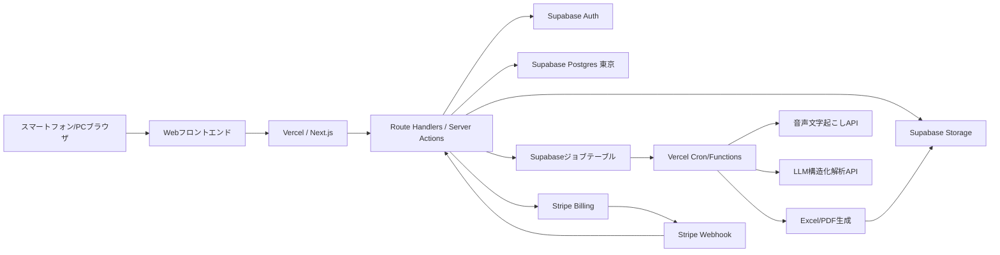

# 音声AI見積作成システム 技術設計 初期案

## 推奨技術構成

### アプリケーション

| 領域 | 推奨技術 | 採用理由 |
| --- | --- | --- |
| ホスティング | Vercel | Next.jsとの相性が良く、スマートフォン/PC向けWebアプリ、API Routes、Cronを一体で運用しやすい。 |
| フロントエンド | Next.js / React / TypeScript | スマートフォンとPCのレスポンシブWebアプリを単一コードベースで構築しやすい。 |
| UI | Tailwind CSS または既存デザインシステム | 管理画面、入力画面、帳票操作を短期間で整備しやすい。 |
| バックエンド | Next.js Route Handlers / Server Actions | フロントエンドと型を共有し、Vercel上で同一プロジェクトとして運用しやすい。 |
| DB | Supabase Postgres（東京リージョン） | PostgreSQL、JSONB、RLS、バックアップ、管理画面をまとめて利用でき、日本国内ユーザーのレイテンシも抑えやすい。 |
| ORM/DBクライアント | Supabase JS + 必要に応じてPrisma | RLSとSupabase Authを活かす処理はSupabase JS、型安全なサーバー処理やマイグレーション補助にはPrismaを検討する。 |
| ファイル保存 | Supabase Storage | 音声、ロゴ、Excel、PDFを会社単位のパスと署名URLで管理しやすい。 |
| 非同期処理 | Supabaseジョブテーブル + Vercel Cron/Functions | 文字起こし、AI解析、Excel/PDF生成をジョブ化する。長時間処理が増えたら専用Workerへ分離する。 |
| 認証 | Supabase Auth | メール・パスワード認証、セッション管理、RLS連携を標準機能で扱える。 |
| 課金 | Stripe Billing / Checkout / Customer Portal | 会社単位の月額課金、オプション課金、請求管理、カード決済を短期間で実装できる。 |
| AI連携 | OpenAI Audio Transcriptions API + OpenAI Responses API | 音声からテキスト化し、Structured Outputsで見積候補JSONへ変換する。 |
| Excel処理 | ExcelJS | テンプレートExcelへの値差し込み、将来の独自テンプレート対応に向く。 |
| PDF処理 | Playwright / Chromium または PDFKit | HTML帳票からPDF生成し、見た目をWebと揃えやすい。 |

### MVPでの基本方針

- スマートフォン録音はブラウザの MediaRecorder API を使用する。
- 音声ファイルはアップロード後に文字起こしジョブを起動する。
- AI解析結果は見積へ直接反映せず、確認画面でユーザーが確定した結果だけを見積データに保存する。
- 金額計算はAIではなく、単価マスターの単価、数量、ユーザー編集値を正とする。
- PDFは顧客提出用、Excelは顧客提出用に加えて社内確認用または業者指示用の出力モードを持つ。
- 顧客との打ち合わせ録音、要約、見積反映候補抽出は別オプションとし、MVP本体では明細入力用の短い音声入力を優先する。
- インフラは Vercel + Supabase東京リージョン + Stripe を基本構成とする。
- Supabase AuthのユーザーIDをアプリ側 `users` の `auth_user_id` と紐づけ、業務権限と `tenant_id` はアプリDBで管理する。
- Stripeの契約状態を `tenants` または課金テーブルに同期し、アプリ内の機能解放はStripeを直接参照せずDB上の状態を正とする。

外部API選定の詳細は [11_api_selection_design.md](11_api_selection_design.md) を正とする。

## 論理アーキテクチャ



### 主要コンポーネント

| コンポーネント | 役割 |
| --- | --- |
| Webフロントエンド | ログイン、音声入力、AI解析結果確認、見積編集、マスター管理、帳票出力操作を提供する。 |
| Vercel / Next.js | Web画面、API、Stripe Webhook、Cron起動を提供する。 |
| アプリケーションAPI | Supabase Auth検証、権限判定、会社単位のデータ分離、DB更新、署名URL発行、ジョブ投入を担当する。 |
| Worker | Vercel Cron/Functionsからジョブを処理し、音声文字起こし、AI構造化解析、Excel取り込み検証、Excel/PDF生成など時間のかかる処理を実行する。 |
| Supabase Auth | ログイン、セッション、パスワード再設定を担当する。 |
| Supabase Postgres | 会社、ユーザー、顧客、単価マスター、見積、AI解析履歴、課金状態、出力履歴を保存する。 |
| Supabase Storage | 音声ファイル、会社ロゴ、アップロードExcel、生成Excel、生成PDFを保存する。 |
| Stripe | 月額課金、オプション課金、決済、請求書、契約変更、カスタマーポータルを担当する。 |
| AI連携層 | プロンプト、JSONスキーマ、リトライ、ログマスキング、利用量記録を集約する。 |
| 帳票生成層 | Excel/PDFそれぞれの表示項目を明示的にホワイトリスト化して出力する。 |

### 代表的な処理フロー

1. 音声入力フロー
   - ブラウザで録音し、API経由で音声ファイルを保存する。
   - APIが文字起こしジョブを投入する。
   - Workerが文字起こしAPIを呼び、結果を `ai_analysis_runs` に保存する。
   - ユーザーが文字起こし結果を確認・修正する。

2. AI見積解析フロー
   - 確認済みテキストと必要最小限の単価候補をLLMへ渡す。
   - LLMは見積候補、確認事項、業者指示候補をJSONで返す。
   - システムは品目候補を単価マスターと再照合し、金額計算をサーバー側で行う。
   - ユーザーが確認した内容のみ見積へ反映する。

3. 帳票出力フロー
   - APIが見積、会社、顧客、明細を取得する。
   - 出力モードに応じて帳票用DTOを生成する。
   - PDF用DTOには業者指示事項を含めない。
   - WorkerがExcelまたはPDFを生成し、保存URLを返す。

4. 課金フロー
   - 管理者がプラン選択またはオプション追加を行う。
   - APIがStripe Checkout SessionまたはCustomer Portalを作成する。
   - Stripe WebhookをVercel APIで受け、署名検証と冪等性チェックを行う。
   - 契約状態、プラン、オプション有効状態をSupabase Postgresへ同期する。
   - アプリの機能制御はStripe APIを都度参照せず、同期済みDB状態と `feature_flags` を参照する。

## 主要DBテーブル案

会社間データ分離の詳細は [10_database_security_design.md](10_database_security_design.md) を正とする。以下の主要DBテーブルは、`tenants` を除き原則として `tenant_id` を持つ。

### tenants

会社単位のデータ分離の基点。

| カラム | 型 | 説明 |
| --- | --- | --- |
| id | uuid PK | 会社ID |
| name | varchar | 会社名 |
| postal_code | varchar | 郵便番号 |
| address | text | 住所 |
| phone | varchar | 電話番号 |
| email | varchar | メールアドレス |
| representative_name | varchar | 代表者名 |
| logo_file_id | uuid FK | ロゴ画像 |
| invoice_registration_no | varchar | 適格請求書発行事業者番号 |
| bank_account_text | text | 振込先情報 |
| default_note | text | 見積書標準備考 |
| subscription_plan | varchar | 契約プラン |
| subscription_status | varchar | 契約状態 |
| stripe_customer_id | varchar | Stripe Customer ID |
| stripe_subscription_id | varchar | Stripe Subscription ID |
| current_period_end | timestamptz | 現在の契約期間終了日時 |
| feature_flags | jsonb | 打ち合わせ録音などのオプション有効化フラグ |
| created_at / updated_at | timestamptz | 作成・更新日時 |

### users

| カラム | 型 | 説明 |
| --- | --- | --- |
| id | uuid PK | ユーザーID |
| auth_user_id | uuid | Supabase AuthユーザーID |
| tenant_id | uuid FK | 会社ID |
| name | varchar | 氏名 |
| email | varchar | メールアドレス |
| role | enum | `admin`, `member` |
| permissions | jsonb | 単価編集、Excel取り込みなどの追加権限 |
| status | enum | `active`, `suspended` |
| last_login_at | timestamptz | 最終ログイン日時 |
| created_at / updated_at | timestamptz | 作成・更新日時 |

### customers

| カラム | 型 | 説明 |
| --- | --- | --- |
| id | uuid PK | 顧客ID |
| tenant_id | uuid FK | 会社ID |
| name | varchar | 顧客名 |
| name_kana | varchar | 顧客名カナ |
| postal_code | varchar | 郵便番号 |
| address | text | 住所 |
| phone | varchar | 電話番号 |
| email | varchar | メールアドレス |
| contact_name | varchar | 担当者名 |
| note | text | 備考 |
| created_at / updated_at | timestamptz | 作成・更新日時 |
| deleted_at | timestamptz nullable | 論理削除日時 |

### price_items

| カラム | 型 | 説明 |
| --- | --- | --- |
| id | uuid PK | 品目ID |
| tenant_id | uuid FK | 会社ID |
| external_item_code | varchar nullable | 外部連携用品目コード |
| name | varchar | 品目 |
| unit | varchar | 単位 |
| unit_price | numeric | 単価 |
| is_active | boolean | 有効フラグ |
| created_at / updated_at | timestamptz | 作成・更新日時 |

### estimates

| カラム | 型 | 説明 |
| --- | --- | --- |
| id | uuid PK | 見積ID |
| tenant_id | uuid FK | 会社ID |
| estimate_no | varchar | 見積番号 |
| customer_id | uuid FK nullable | 顧客ID |
| title | varchar | 件名 |
| estimate_date | date | 見積日 |
| expires_on | date | 有効期限 |
| status | enum | `draft`, `submitted`, `won`, `lost`, `cancelled` |
| subtotal_amount | numeric | 小計 |
| tax_amount | numeric | 消費税 |
| total_amount | numeric | 合計金額 |
| customer_note | text | 顧客向け備考 |
| internal_vendor_instruction | text | 業者指示事項。内部情報として管理し、PDF出力には使用しない。 |
| source_ai_analysis_id | uuid FK nullable | 元AI解析ID |
| created_by / updated_by | uuid FK | 作成者・更新者 |
| created_at / updated_at | timestamptz | 作成・更新日時 |
| deleted_at | timestamptz nullable | 論理削除日時 |

### estimate_lines

| カラム | 型 | 説明 |
| --- | --- | --- |
| id | uuid PK | 明細ID |
| tenant_id | uuid FK | 会社ID |
| estimate_id | uuid FK | 見積ID |
| line_no | integer | 行番号 |
| price_item_id | uuid FK nullable | 品目ID |
| external_line_id | varchar nullable | 外部システム由来の明細ID |
| external_item_code | varchar nullable | 外部システム由来の品目コード |
| location | varchar | 場所。施工場所、部位、階、部屋名など |
| item_name | varchar | 品目名 |
| description | text | 明細説明 |
| quantity | numeric | 数量 |
| unit | varchar | 単位 |
| unit_price | numeric | 単価 |
| amount | numeric | 金額 |
| line_type | enum | `normal`, `discount`, `expense`, `note` |
| customer_note | text | 顧客向け備考 |
| internal_vendor_instruction | text | 明細単位の業者指示事項。内部情報として管理し、PDF出力には使用しない。 |
| created_at / updated_at | timestamptz | 作成・更新日時 |

明細行の表示順は `line_no` で管理する。ドラッグアンドドロップで並び替えた場合は、クライアントが並び替え後の明細ID配列をAPIへ送信し、サーバー側で同一見積内の `line_no` を一括更新する。

### ai_analysis_runs

| カラム | 型 | 説明 |
| --- | --- | --- |
| id | uuid PK | 解析ID |
| tenant_id | uuid FK | 会社ID |
| user_id | uuid FK | 実行ユーザー |
| input_type | enum | `audio`, `text` |
| audio_file_id | uuid FK nullable | 音声ファイル |
| input_text | text | 入力テキスト |
| transcript_text | text | 文字起こし結果 |
| normalized_text | text | ユーザー修正後テキスト |
| extraction_json | jsonb | AI抽出結果 |
| confirmation_questions | jsonb | 確認事項 |
| status | enum | `queued`, `processing`, `completed`, `failed`, `confirmed` |
| error_message | text | エラー内容 |
| created_at / updated_at | timestamptz | 作成・更新日時 |

### meeting_recordings（別オプション）

打ち合わせ録音オプションが有効な会社のみ使用する。オプション無効時は画面導線を非表示にし、API側でも利用を拒否する。

| カラム | 型 | 説明 |
| --- | --- | --- |
| id | uuid PK | 打ち合わせ録音ID |
| tenant_id | uuid FK | 会社ID |
| customer_id | uuid FK nullable | 顧客ID |
| estimate_id | uuid FK nullable | 見積ID |
| sales_user_id | uuid FK | 営業担当者ID |
| audio_file_id | uuid FK nullable | 音声ファイル |
| recorded_at | timestamptz | 録音日時 |
| consent_confirmed | boolean | 録音同意確認済みフラグ |
| transcript_text | text | 文字起こし結果 |
| summary | text | 要点 |
| customer_requests | jsonb | 顧客要望 |
| confirmation_items | jsonb | 確認事項 |
| estimate_apply_candidates | jsonb | 見積反映候補 |
| status | enum | `draft`, `recorded`, `transcribed`, `summarized`, `failed` |
| created_at / updated_at | timestamptz | 作成・更新日時 |

### import_jobs

| カラム | 型 | 説明 |
| --- | --- | --- |
| id | uuid PK | 取り込みジョブID |
| tenant_id | uuid FK | 会社ID |
| user_id | uuid FK | 実行ユーザー |
| file_id | uuid FK | アップロードExcel |
| mapping_json | jsonb | 列マッピング |
| preview_json | jsonb | プレビュー結果 |
| result_json | jsonb | 成功・失敗・警告件数 |
| status | enum | `uploaded`, `mapped`, `validated`, `imported`, `failed` |
| created_at / updated_at | timestamptz | 作成・更新日時 |

### files

| カラム | 型 | 説明 |
| --- | --- | --- |
| id | uuid PK | ファイルID |
| tenant_id | uuid FK | 会社ID |
| owner_user_id | uuid FK nullable | 所有ユーザー |
| kind | enum | `audio`, `meeting_audio`, `logo`, `import_excel`, `estimate_excel`, `estimate_pdf` |
| storage_key | text | ストレージキー |
| original_name | varchar | 元ファイル名 |
| content_type | varchar | MIMEタイプ |
| size_bytes | bigint | サイズ |
| created_at | timestamptz | 作成日時 |
| expires_at | timestamptz nullable | 保存期限 |

### export_jobs

| カラム | 型 | 説明 |
| --- | --- | --- |
| id | uuid PK | 出力ジョブID |
| tenant_id | uuid FK | 会社ID |
| estimate_id | uuid FK | 見積ID |
| user_id | uuid FK | 実行ユーザー |
| export_type | enum | `excel`, `pdf` |
| export_mode | enum | `customer`, `internal`, `vendor_instruction` |
| status | enum | `queued`, `processing`, `completed`, `failed` |
| output_file_id | uuid FK nullable | 生成ファイル |
| created_at / updated_at | timestamptz | 作成・更新日時 |

## API一覧案

### 認証・ユーザー

| メソッド | パス | 概要 | 権限 |
| --- | --- | --- | --- |
| POST | `/api/auth/login` | ログイン | 未認証 |
| POST | `/api/auth/logout` | ログアウト | 認証済み |
| POST | `/api/auth/password-reset/request` | パスワード再設定依頼 | 未認証 |
| POST | `/api/auth/password-reset/confirm` | パスワード再設定確定 | 未認証 |
| GET | `/api/users` | ユーザー一覧 | 管理者 |
| POST | `/api/users` | ユーザー作成 | 管理者 |
| PATCH | `/api/users/{userId}` | ユーザー編集・停止 | 管理者 |

### 会社設定

| メソッド | パス | 概要 | 権限 |
| --- | --- | --- | --- |
| GET | `/api/company` | 自社情報取得 | 認証済み |
| PATCH | `/api/company` | 自社情報更新 | 管理者 |
| POST | `/api/company/logo` | ロゴアップロード | 管理者 |

### 顧客

| メソッド | パス | 概要 | 権限 |
| --- | --- | --- | --- |
| GET | `/api/customers` | 顧客検索・一覧 | 認証済み |
| POST | `/api/customers` | 顧客作成 | 認証済み |
| GET | `/api/customers/{customerId}` | 顧客詳細 | 認証済み |
| PATCH | `/api/customers/{customerId}` | 顧客編集 | 認証済み |
| DELETE | `/api/customers/{customerId}` | 顧客削除 | 認証済み |

### 単価マスター・Excel取り込み

| メソッド | パス | 概要 | 権限 |
| --- | --- | --- | --- |
| GET | `/api/price-items` | 単価マスター検索・一覧 | 認証済み |
| POST | `/api/price-items` | 単価マスター作成 | 管理者または許可ユーザー |
| PATCH | `/api/price-items/{itemId}` | 単価マスター編集 | 管理者または許可ユーザー |
| DELETE | `/api/price-items/{itemId}` | 単価マスター削除 | 管理者または許可ユーザー |
| POST | `/api/price-items/imports` | Excelアップロード・取り込みジョブ作成 | 管理者または許可ユーザー |
| PATCH | `/api/price-items/imports/{jobId}/mapping` | 列マッピング更新 | 管理者または許可ユーザー |
| POST | `/api/price-items/imports/{jobId}/preview` | 取り込みプレビュー作成 | 管理者または許可ユーザー |
| POST | `/api/price-items/imports/{jobId}/execute` | 取り込み実行 | 管理者または許可ユーザー |

### 音声入力・AI解析

| メソッド | パス | 概要 | 権限 |
| --- | --- | --- | --- |
| POST | `/api/ai/audio` | 音声アップロード・文字起こしジョブ作成 | 認証済み |
| POST | `/api/ai/transcriptions/{analysisId}/confirm` | 文字起こし結果の修正確定 | 認証済み |
| POST | `/api/ai/estimate-analysis` | テキスト解析ジョブ作成 | 認証済み |
| GET | `/api/ai/analysis-runs/{analysisId}` | AI解析結果取得 | 認証済み |
| POST | `/api/ai/analysis-runs/{analysisId}/apply` | 確認済みAI結果から見積下書き作成 | 認証済み |

### 打ち合わせ録音（別オプション）

以下のAPIは打ち合わせ録音オプションが有効な会社のみ利用できる。

| メソッド | パス | 概要 | 権限 |
| --- | --- | --- | --- |
| POST | `/api/meeting-recordings` | 打ち合わせ録音作成・音声アップロード | 認証済み |
| GET | `/api/meeting-recordings/{recordingId}` | 打ち合わせ録音詳細取得 | 認証済み |
| PATCH | `/api/meeting-recordings/{recordingId}` | 文字起こし・営業メモ編集 | 認証済み |
| POST | `/api/meeting-recordings/{recordingId}/summarize` | 要点・顧客要望・確認事項のAI整理 | 認証済み |
| POST | `/api/meeting-recordings/{recordingId}/apply` | 採用した見積反映候補を見積へ反映 | 認証済み |

### 見積

| メソッド | パス | 概要 | 権限 |
| --- | --- | --- | --- |
| GET | `/api/estimates` | 見積検索・一覧 | 認証済み |
| POST | `/api/estimates` | 見積作成 | 認証済み |
| GET | `/api/estimates/{estimateId}` | 見積詳細 | 認証済み |
| PATCH | `/api/estimates/{estimateId}` | 見積ヘッダー更新 | 認証済み |
| POST | `/api/estimates/{estimateId}/lines` | 明細追加 | 認証済み |
| PATCH | `/api/estimates/{estimateId}/lines/{lineId}` | 明細編集 | 認証済み |
| DELETE | `/api/estimates/{estimateId}/lines/{lineId}` | 明細削除 | 認証済み |
| PATCH | `/api/estimates/{estimateId}/lines/reorder` | 明細並び替え | 認証済み |
| POST | `/api/estimates/{estimateId}/duplicate` | 見積複製 | 認証済み |
| POST | `/api/estimates/{estimateId}/revision` | 修正見積作成 | 認証済み |
| DELETE | `/api/estimates/{estimateId}` | 見積削除 | 管理者 |

### 帳票出力

| メソッド | パス | 概要 | 権限 |
| --- | --- | --- | --- |
| POST | `/api/estimates/{estimateId}/exports/excel` | Excel出力ジョブ作成 | 認証済み |
| POST | `/api/estimates/{estimateId}/exports/pdf` | PDF出力ジョブ作成 | 認証済み |
| GET | `/api/export-jobs/{jobId}` | 出力ジョブ状態取得 | 認証済み |
| GET | `/api/files/{fileId}/download-url` | ダウンロードURL発行 | 認証済み |

PDF出力APIでは、サーバー側で顧客提出用DTOを生成し、`internal_vendor_instruction` をDTOに含めない。クライアントから業者指示事項を送信してPDFを生成する形式にはしない。

## AI解析JSONスキーマ案

AI解析結果は候補であり、ユーザー確定まで見積には反映しない。スキーマはJSON Schemaとしてバージョン管理し、`schema_version` で互換性を管理する。詳細仕様は `docs/16_ai_json_schema_design.md` を正とし、MVPでは `schema_version: "1.1"` を使用する。

AIは顧客情報、見積件名、見積日、有効期限、担当者、ステータス、顧客向けヘッダー備考などのヘッダー情報を入力しない。また、明細の単位はAIが判断せず、ユーザーが選択した単価マスターの `unit` を使用する。

```json
{
  "schema_version": "1.1",
  "language": "ja",
  "summary": "外壁塗装の現地確認メモ。足場、洗浄、下塗り、上塗りが必要。",
  "source_quality": {
    "overall": "medium",
    "issues": ["数量が概算表現"]
  },
  "line_candidates": [
    {
      "client_candidate_id": "cand-001",
      "source_text": "外壁が120平米くらい",
      "location": "外壁",
      "work_name": "外壁塗装",
      "description": "外壁塗装 下塗り・上塗り",
      "quantity": 120,
      "matched_price_item_candidates": [
        {
          "price_item_id": "uuid",
          "name": "外壁塗装",
          "unit": "m2",
          "unit_price": 2500,
          "match_reason": "作業名が近い。単位と単価は単価マスター値。",
          "confidence": 0.86
        }
      ],
      "customer_note": null,
      "confidence": 0.8,
      "needs_user_confirmation": false
    }
  ],
  "missing_information": [
    {
      "field": "paint_grade",
      "question": "使用する塗料グレードを確認してください。",
      "scope": "line",
      "line_candidate_id": "cand-001",
      "severity": "warning"
    }
  ],
  "internal_vendor_instruction_candidates": [
    {
      "scope": "line",
      "line_candidate_id": "cand-001",
      "text": "高圧洗浄時に近隣車両への飛散養生を確認する。",
      "source_text": "隣の駐車場が近い",
      "confidence": 0.74
    }
  ],
  "assumptions": [
    "数量は発話内容の概算値を使用しています。"
  ]
}
```

### スキーマ設計ルール

- AI解析JSONには、顧客情報、見積ヘッダー情報、顧客向けヘッダー備考を含めない。
- `line_candidates` には `unit` と `unit_price` を含めない。
- `matched_price_item_candidates` はAIの推定だけで確定せず、サーバー側でも `tenant_id` で絞った単価マスターを再検索する。
- `matched_price_item_candidates` に表示する `unit` と `unit_price` は、AI判断値ではなく単価マスターから取得したDB値として扱う。
- 明細反映時の `unit` と `unit_price` は、ユーザーが選択した単価マスター品目からサーバー側で設定する。
- `missing_information` は見積編集画面で確認事項として表示する。
- `internal_vendor_instruction_candidates` は明細単位の内部情報候補として扱い、ユーザーが確定した場合のみ `estimate_lines.internal_vendor_instruction` に保存する。見積全体の業者指示事項はユーザー入力とする。
- 顧客提出用PDFの生成処理には、AI解析JSON内の `internal_vendor_instruction_candidates` も渡さない。

## Excel/PDF出力方式

### Excel出力

Excel出力はExcelJSで標準テンプレートを読み込み、セル名またはテンプレート定義に基づいて値を差し込む。

| 出力モード | 用途 | 業者指示事項 |
| --- | --- | --- |
| `customer` | 顧客提出用Excel | 原則出力しない。 |
| `internal` | 社内確認用Excel | 見積全体・明細ごとの内部メモとして出力できる。 |
| `vendor_instruction` | 協力業者指示用Excel | 必要項目に限定して出力できる。 |

設計方針:

- 帳票テンプレートと帳票データDTOを分離する。
- 出力項目はDTO生成時にホワイトリスト化する。
- 将来の独自Excelテンプレート対応に備え、テンプレート定義テーブルまたはJSON設定でセルマッピングを管理できる構造にする。
- ファイル名は `見積番号_顧客名_YYYYMMDD.xlsx` を基本とする。
- 100明細以内で10秒以内の生成を目標に、生成処理は非同期ジョブ化する。

### PDF出力

PDF出力は顧客提出用のみをMVPの基本とし、HTML帳票をサーバー側でレンダリングしてPDF化する。

設計方針:

- A4縦を基本レイアウトにする。
- PDF出力APIは `estimateId` と出力オプションのみを受け取り、本文データをクライアントから受け取らない。
- サーバー側で `CustomerEstimatePdfDTO` を生成し、会社情報、顧客情報、見積明細、合計金額、顧客向け備考だけを含める。
- 業者指示事項は内部情報としてDBに保存するが、PDF出力API、PDF生成Worker、HTMLテンプレート、PDFファイルのいずれにも渡さない。
- `internal_vendor_instruction` を誤って参照しないよう、PDF DTOの型に該当フィールドを定義しない。
- 監査用に出力ジョブ履歴を保存するが、PDF出力ログにも業者指示事項は記録しない。

## セキュリティ/権限

### データ分離

- すべての業務テーブルに `tenant_id` を持たせ、API層でログインユーザーの `tenant_id` と一致するデータのみ参照・更新する。
- DBレベルでもRow Level Security相当の仕組みを導入し、API実装漏れがあっても他社データが返らないようにする。
- 子テーブルから親テーブルを参照する場合は、原則として `(tenant_id, parent_id)` の複合外部キーを使い、会社をまたいだ紐づけをDBレベルで防止する。
- クライアントから送られた `tenant_id` は信用せず、サーバー側でログインユーザーのセッションから確定する。
- ORMでは `id` 単体の検索を禁止し、必ず `tenant_id` 条件付きのRepositoryを経由する。
- ファイルの `storage_key` には `tenant_id` を含め、署名URL発行時にも所有会社を検証する。

### 認証・認可

- 認証はSupabase Authを利用し、パスワードハッシュやパスワード再設定トークンをアプリDBで直接管理しない。
- アプリDBの `users` はSupabase Authの `auth.users.id` を `auth_user_id` として参照するプロフィール/権限テーブルとする。
- セッションCookieまたはJWTはSupabase Authの仕組みを利用し、本番では `Secure`, `HttpOnly` 相当の安全なセッション運用を行う。
- 管理者と一般担当者の基本ロールに加え、単価マスター編集、Excel取り込みなどは `permissions` で細分化できるようにする。
- 見積削除は管理者のみとし、通常は論理削除にする。

### Stripe課金・Webhook

- Stripe Secret KeyとWebhook Signing SecretはVercelの環境変数で管理し、ブラウザへ渡さない。
- Stripe Webhookは署名検証を必須とし、`stripe_event_id` を保存して冪等に処理する。
- 契約状態はWebhookでSupabase Postgresへ同期し、アプリ内のプラン判定は同期済みDBを参照する。
- 決済失敗、解約、支払期限切れの場合は、即時停止ではなく猶予期間や管理者通知を設ける。

### AI・音声データ保護

- AI APIへ送信するデータは、解析に必要なテキスト、単価候補、会社内設定に限定する。
- 不要な個人情報、内部メモ、業者指示事項をAIへ再送しない。
- 音声ファイル、文字起こし、AI解析履歴の保存期間を設定値で管理する。
- AI API利用ログには本文をそのまま残さず、解析ID、トークン量、処理時間、エラー種別などを中心に記録する。
- 利用規約とプライバシーポリシーに、AI APIへ送信するデータ種別と保存方針を明記する。

### 帳票情報漏えい対策

- 顧客提出用PDFの出力項目はDTOで明示し、業者指示事項を含むDBフィールドを参照しない。
- Excelは出力モードを明示し、`customer` モードでは業者指示事項を含めない。
- 顧客提出用ファイルと社内・業者指示用ファイルはファイル種別、ファイル名、出力履歴で区別する。
- ダウンロードURLは短時間の署名URLとし、推測可能な公開URLを使用しない。

### 監査・運用

- ログイン、Excel取り込み、AI解析、見積出力、削除操作は監査ログに記録する。
- 重要データ削除には確認操作を設ける。
- DBは日次バックアップを行い、復旧手順を運用設計に含める。

## 将来拡張

### Googleスプレッドシート連携

- `export_jobs` を拡張し、`export_type = google_sheet` を追加できる構造にする。
- 帳票DTOをExcel/PDFと共通化し、出力先だけを差し替える。

### LINE・メール送信

- 顧客送付は `delivery_jobs` テーブルを追加し、PDF生成と送信を分離する。
- 送信前にユーザー確認を必須とし、AIやシステムによる顧客への自動送信は行わない。

### 請求書作成

- 見積から受注ステータスへ変更後、請求書ドラフトを生成できるよう `invoices` と `invoice_lines` を追加する。
- 見積明細を請求明細へコピーし、税計算ロジックを共通化する。

### 業種別テンプレート

- `industry_templates` を追加し、AIプロンプト、確認事項、標準品目、帳票テンプレートを業種別に切り替える。
- MVPではリフォーム・外壁塗装系を初期テンプレートとして定義する。

### 過去見積活用

- 見積明細、顧客属性、品目を検索できるようにし、類似案件候補の提示へ拡張する。
- ベクトル検索を追加する場合も、会社単位のデータ分離を必須とする。

### 独自Excelテンプレート

- `report_templates` と `template_mappings` を追加し、会社ごとのExcelテンプレートとセルマッピングを管理する。
- テンプレート登録時に必須項目の存在確認、プレビュー生成、テスト出力を行う。

### 写真・図面解析

- `ai_analysis_runs.input_type` に `image` や `drawing` を追加できるようにする。
- 数量拾いはAI候補として扱い、ユーザー確認後にのみ見積へ反映する。
