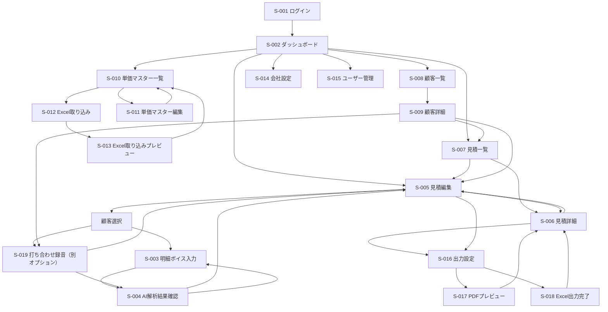
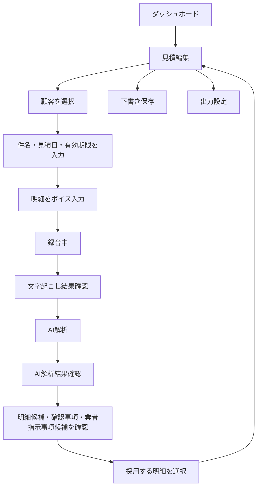
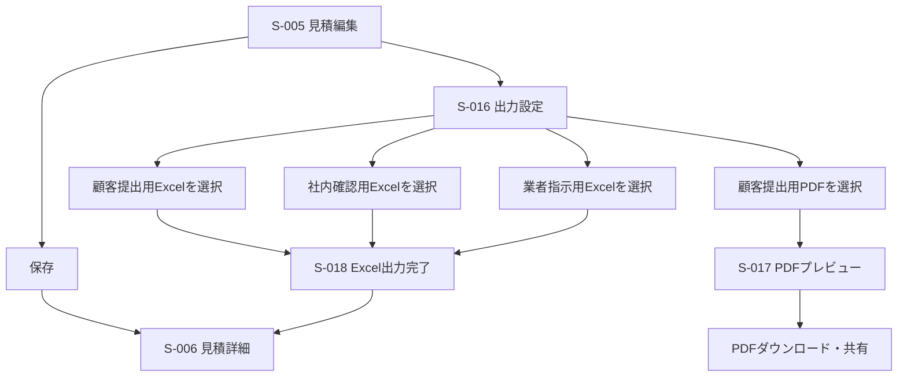
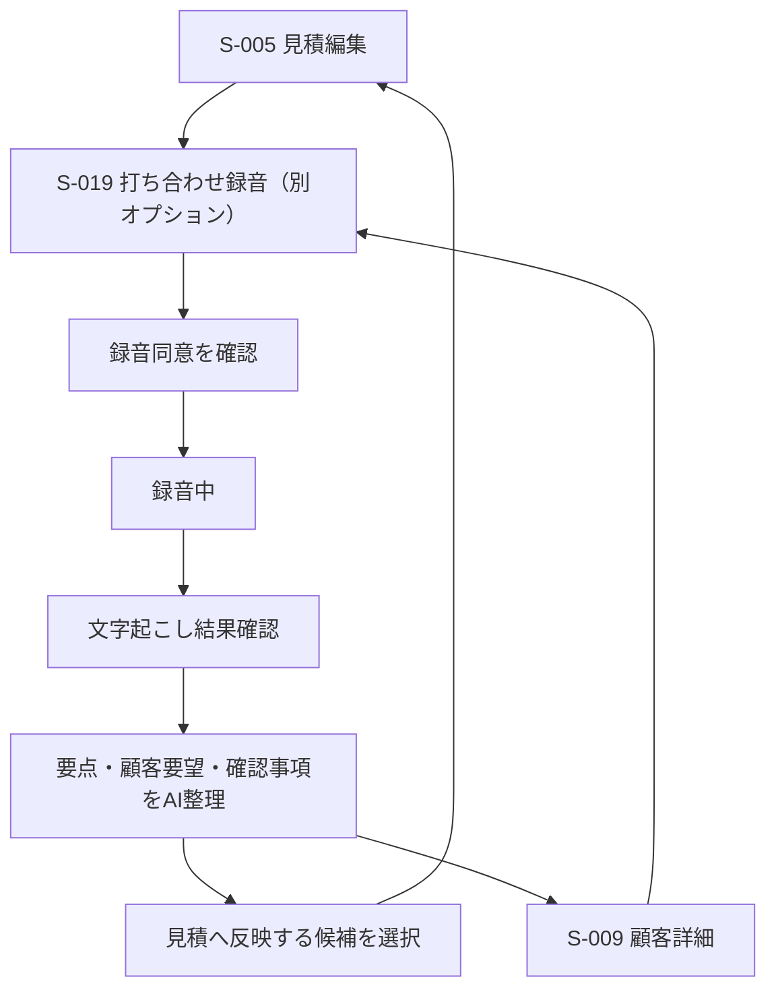
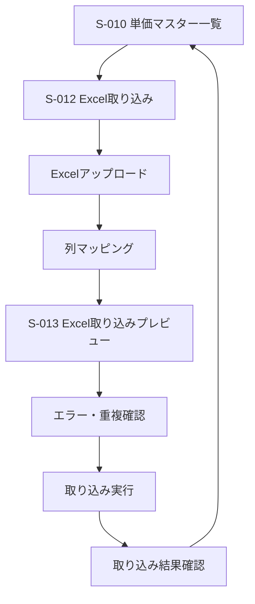
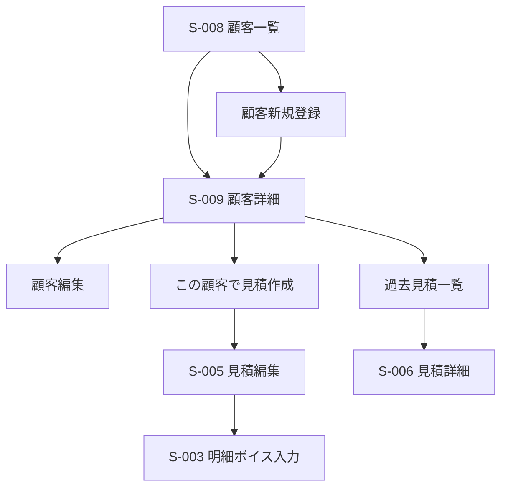
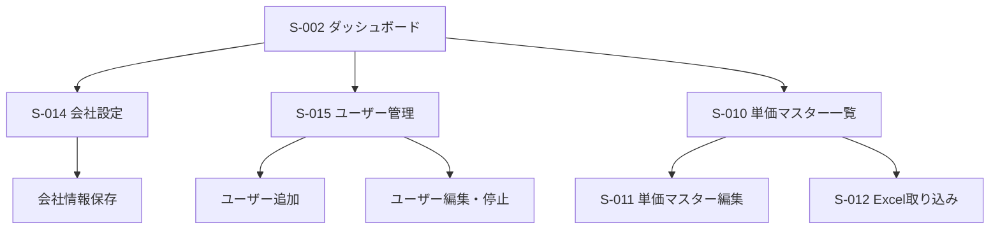

# 画面遷移図

## 1. 目的

本ドキュメントは、音声AI見積作成システムの主要画面と画面遷移を定義する。

現場担当者は、まず見積編集画面で顧客を選択し、その見積に対して明細をボイス入力する。事務担当者または管理者はPCで見積編集、単価マスター管理、Excel取り込み、帳票出力を行う。

## 2. 画面一覧

| 画面ID | 画面名 | 主な利用者 | 主な端末 |
| --- | --- | --- | --- |
| S-001 | ログイン画面 | 全ユーザー | スマホ、PC |
| S-002 | ダッシュボード | 全ユーザー | スマホ、PC |
| S-003 | 明細ボイス入力画面 | 現場担当者、営業担当者 | スマホ |
| S-004 | AI解析結果確認画面 | 現場担当者、営業担当者 | スマホ、PC |
| S-005 | 見積編集画面 | 営業担当者、事務担当者 | スマホ、PC |
| S-006 | 見積詳細画面 | 全ユーザー | スマホ、PC |
| S-007 | 見積一覧画面 | 全ユーザー | スマホ、PC |
| S-008 | 顧客一覧画面 | 全ユーザー | PC |
| S-009 | 顧客詳細画面 | 全ユーザー | スマホ、PC |
| S-010 | 単価マスター一覧画面 | 管理者、事務担当者 | PC |
| S-011 | 単価マスター編集画面 | 管理者、事務担当者 | PC |
| S-012 | Excel取り込み画面 | 管理者、事務担当者 | PC |
| S-013 | Excel取り込みプレビュー画面 | 管理者、事務担当者 | PC |
| S-014 | 会社設定画面 | 管理者 | PC |
| S-015 | ユーザー管理画面 | 管理者 | PC |
| S-016 | 出力設定画面 | 営業担当者、事務担当者 | スマホ、PC |
| S-017 | PDFプレビュー画面 | 営業担当者、事務担当者 | スマホ、PC |
| S-018 | Excel出力完了画面 | 営業担当者、事務担当者 | PC |
| S-019 | 打ち合わせ録音画面 | 営業担当者 | スマホ、PC。別オプション有効時のみ |

## 3. 全体画面遷移

## 4. 見積編集起点の明細ボイス入力フロー

見積作成は、見積編集画面で顧客を選択してから開始する。明細入力は、見積編集画面内のボイス入力導線から行う。

### 4.1 遷移ルール

- 新規見積作成時は、最初に見積編集画面へ遷移する。
- 見積編集画面で顧客を選択してから、明細ボイス入力を開始する。
- 音声入力は見積明細作成の補助機能として扱い、見積本体の作成起点は見積編集画面とする。
- 明細ボイス入力後、文字起こし結果をユーザーが確認してからAI解析へ進む。
- AI解析結果は見積に自動反映せず、ユーザーが採用した項目のみ見積編集画面に反映する。
- 業者指示事項候補は、AI解析結果確認画面では「内部用・PDF非表示」として表示する。
- 1つの見積に対して、明細ボイス入力は複数回実行できる。
- 手入力で明細を追加する導線も残す。

## 5. 見積作成・出力フロー

### 5.1 出力時の表示制御

| 出力種別 | 遷移先 | 業者指示事項 |
| --- | --- | --- |
| 顧客提出用PDF | PDFプレビュー画面 | 表示しない |
| 顧客提出用Excel | Excel出力完了画面 | 原則表示しない |
| 社内確認用Excel | Excel出力完了画面 | 表示できる |
| 業者指示用Excel | Excel出力完了画面 | 表示できる |

PDFプレビュー画面では、業者指示事項が表示されていないことをユーザーが確認できる。

## 6. 営業打ち合わせ録音フロー（別オプション）

営業担当者は、打ち合わせ録音オプションが有効な場合のみ、顧客との打ち合わせ内容を見積または顧客に紐づけて録音できる。録音内容は文字起こしされ、営業メモ、確認事項、見積反映候補として整理する。

### 6.1 遷移ルール

- 打ち合わせ録音は、別オプション有効時のみ、見積編集画面または顧客詳細画面から開始できる。
- 別オプション無効時は、打ち合わせ録音のメニュー、ボタン、画面遷移を表示しない。
- 録音開始前に、顧客への録音同意確認を促す。
- 打ち合わせ録音の文字起こし結果は、営業メモとして保存できる。
- AIが抽出した見積反映候補は、ユーザーが採用するまで見積明細や備考に反映しない。
- 打ち合わせ録音は、顧客履歴と見積履歴の両方から参照できる。

## 7. 単価マスターExcel取り込みフロー

### 7.1 遷移ルール

- Excel取り込みはPC推奨とする。
- アップロード後、必ず列マッピングとプレビューを表示する。
- エラー行、警告行、重複行を確認してから取り込みを実行する。
- 取り込み完了後は単価マスター一覧へ戻る。

## 8. 顧客管理フロー

## 9. 管理者フロー

## 10. 端末別ナビゲーション

### 9.1 スマートフォン

スマートフォンでは、現場入力と見積確認を優先する。

主要導線:

- ダッシュボード
- 見積編集
- 打ち合わせ録音（別オプション有効時のみ）
- 明細ボイス入力
- AI解析結果確認
- 見積詳細
- PDF共有

ナビゲーション:

- 下部ナビゲーションまたはハンバーガーメニューを使用する。
- 主要アクションは画面下部に固定する。
- 単価マスターExcel取り込み、ユーザー管理、会社設定はPC推奨として表示を簡略化する。

### 9.2 PC

PCでは、管理と編集を優先する。

主要導線:

- ダッシュボード
- 見積一覧
- 顧客一覧
- 単価マスター一覧
- Excel取り込み
- 会社設定
- ユーザー管理

ナビゲーション:

- 左サイドバーを使用する。
- 一覧画面から詳細、編集、出力へ遷移する。
- 見積編集画面では右サイドパネルにAI解析元、確認事項、業者指示事項、出力設定を表示する。

## 11. 画面遷移上の重要ルール

- 新規見積は見積編集画面を起点とし、顧客選択後に明細ボイス入力を行う。
- 営業打ち合わせ録音は別オプションとし、オプション有効時のみ見積または顧客に紐づけて保存する。
- 打ち合わせ録音の内容は、ユーザーが採用するまで見積へ反映しない。
- AI解析結果はユーザー確定前に見積へ反映しない。
- 明細ボイス入力は同一見積に対して複数回追加できる。
- 業者指示事項は顧客向けPDFに表示しない。
- 業者指示事項は、社内確認用Excelまたは業者指示用Excelにのみ表示できる。
- 顧客向け備考と業者指示事項は、画面上で別の入力領域として扱う。
- Excel取り込みは、アップロード直後に登録せず、プレビュー確認後に登録する。
- 管理者権限が必要な画面は、一般担当者には非表示または権限不足として表示する。
- 削除や上書きなど取り消しが難しい操作では確認ダイアログを表示する。

## 12. 次に作成する画面設計

画面遷移図の次に、以下の主要画面のワイヤーフレームを作成する。

1. ダッシュボード
2. 明細ボイス入力画面
3. AI解析結果確認画面
4. 見積編集画面
5. 打ち合わせ録音画面（別オプション）
6. 出力設定画面
7. 単価マスターExcel取り込み画面
8. Excel取り込みプレビュー画面
