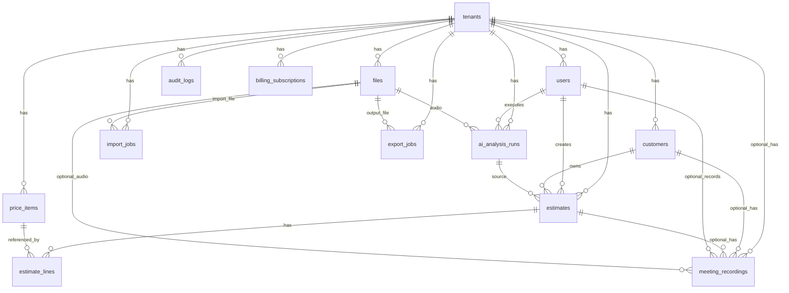

# 音声AI見積作成システム DB詳細設計書

## 1. 文書情報

| 項目 | 内容 |
| --- | --- |
| 文書名 | 音声AI見積作成システム DB詳細設計書 |
| 版数 | v0.1 |
| 作成日 | 2026-06-02 |
| 対象フェーズ | MVP詳細設計 |
| 対象DB | Supabase Postgres（東京リージョン） |
| 関連資料 | `requirements.md`, `docs/04_technical_design.md`, `docs/10_database_security_design.md`, `docs/13_meeting_recording_option_design.md` |

## 2. 目的

本書は、音声AI見積作成システムのデータベース詳細設計を定義する。

特に以下を重視する。

- 会社ごとのデータ分離をDBレベルで担保する。
- 見積、顧客、単価マスター、音声、AI解析、Excel/PDF出力を一貫して管理する。
- 顧客向け情報と内部向け情報を分離する。
- 打ち合わせ録音をMVP本体ではなく別オプションとして扱える設計にする。
- API、Worker、AI連携、帳票出力が参照するデータ構造を明確にする。

## 3. 基本方針

### 3.1 DBMS

| 項目 | 方針 |
| --- | --- |
| DBMS | Supabase Postgres |
| 文字コード | UTF-8 |
| タイムゾーン | DB保存は `timestamptz`。表示はアプリ側でAsia/Tokyoへ変換する |
| 主キー | 原則 `uuid` |
| 金額 | `numeric(14,2)` |
| 数量 | `numeric(12,3)` |
| JSON | AI解析結果、取込プレビュー、権限詳細などに `jsonb` を使用 |
| 削除 | 主要業務データは原則論理削除 |

### 3.2 命名規則

| 対象 | 規則 | 例 |
| --- | --- | --- |
| テーブル名 | snake_case、複数形 | `estimate_lines` |
| カラム名 | snake_case | `tenant_id` |
| 主キー | `id` | `id uuid` |
| 外部キー | `{参照先単数}_id` | `customer_id` |
| 作成日時 | `created_at` | `created_at timestamptz` |
| 更新日時 | `updated_at` | `updated_at timestamptz` |
| 論理削除日時 | `deleted_at` | `deleted_at timestamptz` |
| インデックス | `idx_{table}_{columns}` | `idx_estimates_tenant_status` |
| 一意制約 | `uq_{table}_{columns}` | `uq_estimates_tenant_estimate_no` |
| 外部キー | `fk_{from}_{to}` | `fk_estimates_customers` |

### 3.3 マルチテナント方針

- 会社単位を `tenant` と呼ぶ。
- `tenants` を除く業務テーブルは原則 `tenant_id` を持つ。
- クライアントから送られた `tenant_id` は信用しない。
- APIとWorkerはログインセッションまたはジョブ情報から `tenant_id` を決定する。
- 子テーブルから親テーブルを参照する場合は、原則 `(tenant_id, parent_id)` の複合外部キーを使用する。
- Supabase Row Level Securityを導入し、Supabase Authの `auth.uid()` とアプリDBの `users.auth_user_id` をもとに会社単位の参照・更新を制御する。

## 4. ER図



## 5. テーブル一覧

| No | テーブル | 区分 | 概要 | MVP |
| --- | --- | --- | --- | --- |
| 1 | `tenants` | 基本 | 会社 | 必須 |
| 2 | `users` | 認証/権限 | アプリユーザー。Supabase Auth連携 | 必須 |
| 3 | `billing_subscriptions` | 課金 | Stripe契約状態同期 | 必須 |
| 4 | `stripe_webhook_events` | 課金 | Stripe Webhook冪等処理 | 必須 |
| 5 | `customers` | 業務 | 顧客マスター | 必須 |
| 6 | `price_items` | 業務 | 単価マスター | 必須 |
| 7 | `estimates` | 業務 | 見積ヘッダー | 必須 |
| 8 | `estimate_lines` | 業務 | 見積明細 | 必須 |
| 9 | `ai_analysis_runs` | AI | 音声/テキスト解析履歴 | 必須 |
| 10 | `files` | ファイル | 音声、Excel、PDF、ロゴ | 必須 |
| 11 | `import_jobs` | 非同期 | 単価マスターExcel取込 | 必須 |
| 12 | `export_jobs` | 非同期 | Excel/PDF出力 | 必須 |
| 13 | `audit_logs` | 監査 | 重要操作ログ | 必須 |
| 14 | `meeting_recordings` | オプション | 打ち合わせ録音 | 別オプション |

## 6. ENUM定義

PostgreSQLのENUMまたはアプリケーション定義の文字列制約として管理する。MVPでは移行の容易さを優先し、`varchar` + CHECK制約でもよい。

| 論理名 | 値 |
| --- | --- |
| `tenant_status` | `active`, `suspended`, `cancelled` |
| `user_role` | `admin`, `member` |
| `user_status` | `active`, `suspended` |
| `estimate_status` | `draft`, `submitted`, `won`, `lost`, `cancelled` |
| `estimate_line_type` | `normal`, `discount`, `expense`, `note` |
| `ai_input_type` | `audio`, `text` |
| `ai_analysis_status` | `queued`, `processing`, `completed`, `failed`, `confirmed` |
| `file_kind` | `audio`, `meeting_audio`, `logo`, `import_excel`, `estimate_excel`, `estimate_pdf` |
| `import_job_status` | `uploaded`, `mapped`, `validated`, `imported`, `failed` |
| `export_type` | `excel`, `pdf` |
| `export_mode` | `customer`, `internal`, `vendor_instruction` |
| `export_job_status` | `queued`, `processing`, `completed`, `failed` |
| `audit_result` | `success`, `failure` |
| `meeting_recording_status` | `draft`, `recorded`, `transcribed`, `summarized`, `failed` |
| `subscription_status` | `trialing`, `active`, `past_due`, `canceled`, `unpaid`, `incomplete` |

## 7. 共通カラム

主要テーブルには以下の共通カラムを持たせる。

| カラム | 型 | NULL | 初期値 | 説明 |
| --- | --- | --- | --- | --- |
| `id` | uuid | NO | `gen_random_uuid()` | 主キー |
| `tenant_id` | uuid | 原則NO | なし | 会社ID。`tenants` を除く業務テーブルに付与 |
| `created_at` | timestamptz | NO | `now()` | 作成日時 |
| `updated_at` | timestamptz | NO | `now()` | 更新日時 |
| `deleted_at` | timestamptz | YES | null | 論理削除日時。必要なテーブルのみ |

`updated_at` はアプリケーションまたはDBトリガーで更新する。

## 8. テーブル詳細

### 8.1 tenants

会社情報と契約プランを管理する。

| カラム | 型 | NULL | キー | 初期値 | 説明 |
| --- | --- | --- | --- | --- | --- |
| `id` | uuid | NO | PK | `gen_random_uuid()` | 会社ID |
| `name` | varchar(255) | NO |  |  | 会社名 |
| `postal_code` | varchar(20) | YES |  |  | 郵便番号 |
| `address` | text | YES |  |  | 住所 |
| `phone` | varchar(50) | YES |  |  | 電話番号 |
| `email` | varchar(255) | YES |  |  | 代表メールアドレス |
| `representative_name` | varchar(255) | YES |  |  | 代表者名 |
| `logo_file_id` | uuid | YES |  |  | ロゴファイルID |
| `invoice_registration_no` | varchar(50) | YES |  |  | 適格請求書発行事業者番号 |
| `bank_account_text` | text | YES |  |  | 振込先情報 |
| `default_note` | text | YES |  |  | 見積書標準備考 |
| `subscription_plan` | varchar(50) | NO |  | `'standard'` | 契約プラン |
| `subscription_status` | varchar(20) | NO |  | `'active'` | 契約状態 |
| `stripe_customer_id` | varchar(255) | YES | UNIQUE |  | Stripe Customer ID |
| `stripe_subscription_id` | varchar(255) | YES | UNIQUE |  | Stripe Subscription ID |
| `current_period_end` | timestamptz | YES |  |  | 現在の契約期間終了日時 |
| `feature_flags` | jsonb | NO |  | `'{}'::jsonb` | オプション機能フラグ |
| `status` | varchar(20) | NO |  | `'active'` | 会社ステータス |
| `created_at` | timestamptz | NO |  | `now()` | 作成日時 |
| `updated_at` | timestamptz | NO |  | `now()` | 更新日時 |

制約:

| 制約 | 内容 |
| --- | --- |
| `pk_tenants` | `PRIMARY KEY (id)` |
| `ck_tenants_status` | `status in ('active', 'suspended', 'cancelled')` |
| `ck_tenants_feature_flags_object` | `jsonb_typeof(feature_flags) = 'object'` |

`feature_flags` 例:

```json
{
  "meeting_recording_enabled": false,
  "meeting_summary_enabled": false,
  "meeting_apply_enabled": false
}
```

### 8.2 users

アプリ上のユーザープロフィール、会社所属、ロール、権限を管理する。認証本体はSupabase Authで行い、`auth_user_id` に `auth.users.id` を保存する。ユーザーは必ず1つの会社に所属する。

| カラム | 型 | NULL | キー | 初期値 | 説明 |
| --- | --- | --- | --- | --- | --- |
| `id` | uuid | NO | PK | `gen_random_uuid()` | ユーザーID |
| `auth_user_id` | uuid | NO | UNIQUE |  | Supabase AuthユーザーID |
| `tenant_id` | uuid | NO | FK |  | 会社ID |
| `name` | varchar(255) | NO |  |  | 氏名 |
| `email` | varchar(255) | NO |  |  | メールアドレス |
| `role` | varchar(20) | NO |  | `'member'` | ロール |
| `permissions` | jsonb | NO |  | `'{}'::jsonb` | 追加権限 |
| `status` | varchar(20) | NO |  | `'active'` | ユーザーステータス |
| `last_login_at` | timestamptz | YES |  |  | 最終ログイン日時 |
| `created_at` | timestamptz | NO |  | `now()` | 作成日時 |
| `updated_at` | timestamptz | NO |  | `now()` | 更新日時 |

制約:

| 制約 | 内容 |
| --- | --- |
| `pk_users` | `PRIMARY KEY (id)` |
| `fk_users_tenants` | `FOREIGN KEY (tenant_id) REFERENCES tenants(id)` |
| `uq_users_auth_user_id` | `UNIQUE (auth_user_id)` |
| `uq_users_tenant_email` | `UNIQUE (tenant_id, lower(email))` 相当 |
| `ck_users_role` | `role in ('admin', 'member')` |
| `ck_users_status` | `status in ('active', 'suspended')` |

インデックス:

| インデックス | カラム | 用途 |
| --- | --- | --- |
| `idx_users_tenant_id` | `(tenant_id, id)` | tenant内ユーザー取得 |
| `idx_users_auth_user_id` | `(auth_user_id)` | Supabase Authユーザーとの紐づけ |
| `idx_users_tenant_email` | `(tenant_id, lower(email))` | ログイン、重複確認 |

### 8.3 billing_subscriptions

Stripeの契約状態を会社単位で同期する。アプリ内の機能制御はStripe APIを都度参照せず、本テーブルと `tenants.feature_flags` を参照する。

| カラム | 型 | NULL | キー | 初期値 | 説明 |
| --- | --- | --- | --- | --- | --- |
| `id` | uuid | NO | PK | `gen_random_uuid()` | 契約同期ID |
| `tenant_id` | uuid | NO | FK |  | 会社ID |
| `stripe_customer_id` | varchar(255) | NO |  |  | Stripe Customer ID |
| `stripe_subscription_id` | varchar(255) | YES | UNIQUE |  | Stripe Subscription ID |
| `plan_code` | varchar(50) | NO |  |  | アプリ側プランコード |
| `status` | varchar(20) | NO |  |  | Stripe契約状態 |
| `current_period_start` | timestamptz | YES |  |  | 契約期間開始 |
| `current_period_end` | timestamptz | YES |  |  | 契約期間終了 |
| `cancel_at_period_end` | boolean | NO |  | `false` | 期間終了時解約予定 |
| `metadata` | jsonb | NO |  | `'{}'::jsonb` | Stripe metadata同期 |
| `created_at` | timestamptz | NO |  | `now()` | 作成日時 |
| `updated_at` | timestamptz | NO |  | `now()` | 更新日時 |

### 8.4 stripe_webhook_events

Stripe Webhookの二重処理を防ぐため、受信済みイベントを保存する。

| カラム | 型 | NULL | キー | 初期値 | 説明 |
| --- | --- | --- | --- | --- | --- |
| `id` | uuid | NO | PK | `gen_random_uuid()` | 内部ID |
| `stripe_event_id` | varchar(255) | NO | UNIQUE |  | Stripe Event ID |
| `event_type` | varchar(255) | NO |  |  | イベント種別 |
| `processed_at` | timestamptz | YES |  |  | 処理完了日時 |
| `payload` | jsonb | NO |  |  | 受信payload |
| `created_at` | timestamptz | NO |  | `now()` | 受信日時 |

### 8.5 customers

顧客マスターを管理する。

| カラム | 型 | NULL | キー | 初期値 | 説明 |
| --- | --- | --- | --- | --- | --- |
| `id` | uuid | NO | PK | `gen_random_uuid()` | 顧客ID |
| `tenant_id` | uuid | NO | FK |  | 会社ID |
| `name` | varchar(255) | NO |  |  | 顧客名 |
| `name_kana` | varchar(255) | YES |  |  | 顧客名カナ |
| `postal_code` | varchar(20) | YES |  |  | 郵便番号 |
| `address` | text | YES |  |  | 住所 |
| `phone` | varchar(50) | YES |  |  | 電話番号 |
| `email` | varchar(255) | YES |  |  | メールアドレス |
| `contact_name` | varchar(255) | YES |  |  | 担当者名 |
| `note` | text | YES |  |  | 備考 |
| `created_at` | timestamptz | NO |  | `now()` | 作成日時 |
| `updated_at` | timestamptz | NO |  | `now()` | 更新日時 |
| `deleted_at` | timestamptz | YES |  |  | 論理削除日時 |

制約:

| 制約 | 内容 |
| --- | --- |
| `fk_customers_tenants` | `FOREIGN KEY (tenant_id) REFERENCES tenants(id)` |
| `uq_customers_tenant_id` | `UNIQUE (tenant_id, id)` |

インデックス:

| インデックス | カラム | 用途 |
| --- | --- | --- |
| `idx_customers_tenant_name` | `(tenant_id, name)` | 顧客名検索 |
| `idx_customers_tenant_phone` | `(tenant_id, phone)` | 電話番号検索 |
| `idx_customers_tenant_not_deleted` | `(tenant_id, deleted_at)` | 一覧取得 |

### 8.6 price_items

単価マスターを管理する。AIの品目候補推測でも参照される。

| カラム | 型 | NULL | キー | 初期値 | 説明 |
| --- | --- | --- | --- | --- | --- |
| `id` | uuid | NO | PK | `gen_random_uuid()` | 品目ID |
| `tenant_id` | uuid | NO | FK |  | 会社ID |
| `external_item_code` | varchar(100) | YES |  |  | 外部連携用品目コード。外部建設システムの品目IDなど |
| `name` | varchar(255) | NO |  |  | 品目名 |
| `unit` | varchar(50) | NO |  |  | 単位 |
| `unit_price` | numeric(14,2) | NO |  |  | 単価 |
| `is_active` | boolean | NO |  | `true` | 有効フラグ |
| `created_at` | timestamptz | NO |  | `now()` | 作成日時 |
| `updated_at` | timestamptz | NO |  | `now()` | 更新日時 |
| `deleted_at` | timestamptz | YES |  |  | 論理削除日時 |

制約:

| 制約 | 内容 |
| --- | --- |
| `fk_price_items_tenants` | `FOREIGN KEY (tenant_id) REFERENCES tenants(id)` |
| `uq_price_items_tenant_id` | `UNIQUE (tenant_id, id)` |
| `uq_price_items_tenant_external_item_code` | `UNIQUE (tenant_id, external_item_code)`。`external_item_code is not null` の部分一意制約 |
| `ck_price_items_unit_price` | `unit_price >= 0` |

インデックス:

| インデックス | カラム | 用途 |
| --- | --- | --- |
| `idx_price_items_tenant_name` | `(tenant_id, name)` | 品目検索 |
| `idx_price_items_tenant_name_unit` | `(tenant_id, name, unit)` | AI候補照合 |
| `idx_price_items_tenant_external_item_code` | `(tenant_id, external_item_code)` | 外部システム品目コード照合 |
| `idx_price_items_tenant_active` | `(tenant_id, is_active)` | 有効品目一覧 |

外部連携時は `external_item_code` の完全一致を最優先する。該当がない場合のみ、品目名の完全一致・部分一致や類似検索にフォールバックする。将来、類似検索用に `pg_trgm` またはベクトル検索を追加できる。

### 8.7 estimates

見積ヘッダーを管理する。

| カラム | 型 | NULL | キー | 初期値 | 説明 |
| --- | --- | --- | --- | --- | --- |
| `id` | uuid | NO | PK | `gen_random_uuid()` | 見積ID |
| `tenant_id` | uuid | NO | FK |  | 会社ID |
| `estimate_no` | varchar(50) | NO |  |  | 見積番号 |
| `customer_id` | uuid | YES | FK |  | 顧客ID |
| `title` | varchar(255) | NO |  |  | 件名 |
| `estimate_date` | date | NO |  | `current_date` | 見積日 |
| `expires_on` | date | YES |  |  | 有効期限 |
| `status` | varchar(20) | NO |  | `'draft'` | ステータス |
| `subtotal_amount` | numeric(14,2) | NO |  | `0` | 小計 |
| `tax_amount` | numeric(14,2) | NO |  | `0` | 消費税 |
| `total_amount` | numeric(14,2) | NO |  | `0` | 合計金額 |
| `customer_note` | text | YES |  |  | 顧客向け備考 |
| `internal_vendor_instruction` | text | YES |  |  | 業者指示事項。PDF出力禁止 |
| `source_ai_analysis_id` | uuid | YES | FK |  | 元AI解析ID |
| `created_by` | uuid | NO | FK |  | 作成者 |
| `updated_by` | uuid | YES | FK |  | 更新者 |
| `created_at` | timestamptz | NO |  | `now()` | 作成日時 |
| `updated_at` | timestamptz | NO |  | `now()` | 更新日時 |
| `deleted_at` | timestamptz | YES |  |  | 論理削除日時 |

制約:

| 制約 | 内容 |
| --- | --- |
| `fk_estimates_tenants` | `FOREIGN KEY (tenant_id) REFERENCES tenants(id)` |
| `fk_estimates_customers` | `FOREIGN KEY (tenant_id, customer_id) REFERENCES customers(tenant_id, id)` |
| `fk_estimates_ai_analysis` | `FOREIGN KEY (tenant_id, source_ai_analysis_id) REFERENCES ai_analysis_runs(tenant_id, id)` |
| `fk_estimates_created_by` | `FOREIGN KEY (tenant_id, created_by) REFERENCES users(tenant_id, id)` |
| `fk_estimates_updated_by` | `FOREIGN KEY (tenant_id, updated_by) REFERENCES users(tenant_id, id)` |
| `uq_estimates_tenant_id` | `UNIQUE (tenant_id, id)` |
| `uq_estimates_tenant_estimate_no` | `UNIQUE (tenant_id, estimate_no)` |
| `ck_estimates_status` | `status in ('draft', 'submitted', 'won', 'lost', 'cancelled')` |
| `ck_estimates_amounts` | `subtotal_amount >= 0 and tax_amount >= 0 and total_amount >= 0` |

インデックス:

| インデックス | カラム | 用途 |
| --- | --- | --- |
| `idx_estimates_tenant_customer` | `(tenant_id, customer_id)` | 顧客別見積 |
| `idx_estimates_tenant_status` | `(tenant_id, status)` | ステータス検索 |
| `idx_estimates_tenant_date` | `(tenant_id, estimate_date desc)` | 一覧表示 |
| `idx_estimates_tenant_not_deleted` | `(tenant_id, deleted_at)` | 論理削除除外 |

### 8.8 estimate_lines

見積明細を管理する。並び順は `line_no` で管理する。

| カラム | 型 | NULL | キー | 初期値 | 説明 |
| --- | --- | --- | --- | --- | --- |
| `id` | uuid | NO | PK | `gen_random_uuid()` | 明細ID |
| `tenant_id` | uuid | NO | FK |  | 会社ID |
| `estimate_id` | uuid | NO | FK |  | 見積ID |
| `line_no` | integer | NO |  |  | 行番号 |
| `price_item_id` | uuid | YES | FK |  | 単価マスター品目ID |
| `external_line_id` | varchar(100) | YES |  |  | 外部システム由来の見積明細ID |
| `external_item_code` | varchar(100) | YES |  |  | 外部システム由来の品目コード。単価マスター変換に使用 |
| `location` | varchar(255) | YES |  |  | 場所 |
| `item_name` | varchar(255) | NO |  |  | 品目名 |
| `description` | text | YES |  |  | 明細説明 |
| `quantity` | numeric(12,3) | YES |  |  | 数量 |
| `unit` | varchar(50) | YES |  |  | 単位 |
| `unit_price` | numeric(14,2) | YES |  |  | 単価 |
| `amount` | numeric(14,2) | NO |  | `0` | 金額 |
| `line_type` | varchar(20) | NO |  | `'normal'` | 行種別 |
| `customer_note` | text | YES |  |  | 顧客向け備考 |
| `internal_vendor_instruction` | text | YES |  |  | 業者指示事項。PDF出力禁止 |
| `created_at` | timestamptz | NO |  | `now()` | 作成日時 |
| `updated_at` | timestamptz | NO |  | `now()` | 更新日時 |

制約:

| 制約 | 内容 |
| --- | --- |
| `fk_estimate_lines_estimates` | `FOREIGN KEY (tenant_id, estimate_id) REFERENCES estimates(tenant_id, id)` |
| `fk_estimate_lines_price_items` | `FOREIGN KEY (tenant_id, price_item_id) REFERENCES price_items(tenant_id, id)` |
| `uq_estimate_lines_tenant_id` | `UNIQUE (tenant_id, id)` |
| `uq_estimate_lines_estimate_line_no` | `UNIQUE (tenant_id, estimate_id, line_no)` |
| `uq_estimate_lines_estimate_external_line_id` | `UNIQUE (tenant_id, estimate_id, external_line_id)`。`external_line_id is not null` の部分一意制約 |
| `ck_estimate_lines_line_no` | `line_no > 0` |
| `ck_estimate_lines_line_type` | `line_type in ('normal', 'discount', 'expense', 'note')` |
| `ck_estimate_lines_quantity` | `quantity is null or quantity >= 0` |

金額計算:

| 行種別 | 計算方針 |
| --- | --- |
| `normal` | `quantity * unit_price` を基本とする |
| `discount` | 値引き。`amount` は負数を許可する |
| `expense` | 諸経費。金額手入力も許可する |
| `note` | 注記行。金額は0 |

インデックス:

| インデックス | カラム | 用途 |
| --- | --- | --- |
| `idx_estimate_lines_tenant_estimate_line_no` | `(tenant_id, estimate_id, line_no)` | 明細表示、並び替え |
| `idx_estimate_lines_tenant_price_item` | `(tenant_id, price_item_id)` | 単価マスター利用状況 |
| `idx_estimate_lines_tenant_external_line_id` | `(tenant_id, external_line_id)` | 外部システム明細ID照合 |
| `idx_estimate_lines_tenant_external_item_code` | `(tenant_id, external_item_code)` | 外部品目コード照合 |

### 8.9 ai_analysis_runs

音声入力、テキスト入力、AI解析の履歴を管理する。

| カラム | 型 | NULL | キー | 初期値 | 説明 |
| --- | --- | --- | --- | --- | --- |
| `id` | uuid | NO | PK | `gen_random_uuid()` | AI解析ID |
| `tenant_id` | uuid | NO | FK |  | 会社ID |
| `user_id` | uuid | NO | FK |  | 実行ユーザー |
| `input_type` | varchar(20) | NO |  |  | 入力種別 |
| `audio_file_id` | uuid | YES | FK |  | 音声ファイルID |
| `input_text` | text | YES |  |  | 手入力テキスト |
| `transcript_text` | text | YES |  |  | 文字起こし結果 |
| `normalized_text` | text | YES |  |  | ユーザー修正後テキスト |
| `extraction_json` | jsonb | YES |  |  | AI抽出結果 |
| `confirmation_questions` | jsonb | YES |  |  | 確認事項 |
| `schema_version` | varchar(20) | NO |  | `'1.1'` | AI解析JSONスキーマ版 |
| `status` | varchar(20) | NO |  | `'queued'` | ステータス |
| `error_message` | text | YES |  |  | エラー内容 |
| `created_at` | timestamptz | NO |  | `now()` | 作成日時 |
| `updated_at` | timestamptz | NO |  | `now()` | 更新日時 |

制約:

| 制約 | 内容 |
| --- | --- |
| `fk_ai_analysis_runs_users` | `FOREIGN KEY (tenant_id, user_id) REFERENCES users(tenant_id, id)` |
| `fk_ai_analysis_runs_files` | `FOREIGN KEY (tenant_id, audio_file_id) REFERENCES files(tenant_id, id)` |
| `uq_ai_analysis_runs_tenant_id` | `UNIQUE (tenant_id, id)` |
| `ck_ai_analysis_runs_input_type` | `input_type in ('audio', 'text')` |
| `ck_ai_analysis_runs_status` | `status in ('queued', 'processing', 'completed', 'failed', 'confirmed')` |

インデックス:

| インデックス | カラム | 用途 |
| --- | --- | --- |
| `idx_ai_analysis_runs_tenant_user_created` | `(tenant_id, user_id, created_at desc)` | ユーザー別履歴 |
| `idx_ai_analysis_runs_tenant_status` | `(tenant_id, status)` | ジョブ処理 |

保存ルール:

- `extraction_json` は `docs/16_ai_json_schema_design.md` の v1.1 形式で保存する。
- AI解析結果には、顧客情報、見積ヘッダー情報、顧客向けヘッダー備考を含めない。
- `line_candidates` には `unit` と `unit_price` を保存しない。明細反映時の単位と単価は、選択された単価マスターから取得する。

### 8.10 files

音声、アップロードExcel、生成Excel、PDF、ロゴを管理する。実ファイルはSupabase Storageに保存する。

| カラム | 型 | NULL | キー | 初期値 | 説明 |
| --- | --- | --- | --- | --- | --- |
| `id` | uuid | NO | PK | `gen_random_uuid()` | ファイルID |
| `tenant_id` | uuid | NO | FK |  | 会社ID |
| `owner_user_id` | uuid | YES | FK |  | 所有ユーザー |
| `kind` | varchar(30) | NO |  |  | ファイル種別 |
| `storage_key` | text | NO | UNIQUE |  | ストレージキー |
| `original_name` | varchar(255) | YES |  |  | 元ファイル名 |
| `content_type` | varchar(100) | NO |  |  | MIMEタイプ |
| `size_bytes` | bigint | NO |  |  | サイズ |
| `checksum_sha256` | varchar(64) | YES |  |  | チェックサム |
| `created_at` | timestamptz | NO |  | `now()` | 作成日時 |
| `expires_at` | timestamptz | YES |  |  | 保存期限 |

制約:

| 制約 | 内容 |
| --- | --- |
| `fk_files_tenants` | `FOREIGN KEY (tenant_id) REFERENCES tenants(id)` |
| `fk_files_owner_users` | `FOREIGN KEY (tenant_id, owner_user_id) REFERENCES users(tenant_id, id)` |
| `uq_files_tenant_id` | `UNIQUE (tenant_id, id)` |
| `ck_files_kind` | `kind in ('audio', 'meeting_audio', 'logo', 'import_excel', 'estimate_excel', 'estimate_pdf')` |
| `ck_files_size` | `size_bytes >= 0` |

ストレージキー規則:

```text
tenants/{tenant_id}/audio/{file_id}.webm
tenants/{tenant_id}/meeting-audio/{file_id}.webm
tenants/{tenant_id}/imports/{file_id}.xlsx
tenants/{tenant_id}/exports/{file_id}.xlsx
tenants/{tenant_id}/exports/{file_id}.pdf
tenants/{tenant_id}/logos/{file_id}.png
```

### 8.11 import_jobs

単価マスターExcel取込ジョブを管理する。

| カラム | 型 | NULL | キー | 初期値 | 説明 |
| --- | --- | --- | --- | --- | --- |
| `id` | uuid | NO | PK | `gen_random_uuid()` | 取込ジョブID |
| `tenant_id` | uuid | NO | FK |  | 会社ID |
| `user_id` | uuid | NO | FK |  | 実行ユーザー |
| `file_id` | uuid | NO | FK |  | アップロードExcel |
| `mapping_json` | jsonb | YES |  |  | 列マッピング |
| `preview_json` | jsonb | YES |  |  | プレビュー結果 |
| `result_json` | jsonb | YES |  |  | 実行結果 |
| `status` | varchar(20) | NO |  | `'uploaded'` | ステータス |
| `created_at` | timestamptz | NO |  | `now()` | 作成日時 |
| `updated_at` | timestamptz | NO |  | `now()` | 更新日時 |

制約:

| 制約 | 内容 |
| --- | --- |
| `fk_import_jobs_users` | `FOREIGN KEY (tenant_id, user_id) REFERENCES users(tenant_id, id)` |
| `fk_import_jobs_files` | `FOREIGN KEY (tenant_id, file_id) REFERENCES files(tenant_id, id)` |
| `uq_import_jobs_tenant_id` | `UNIQUE (tenant_id, id)` |
| `ck_import_jobs_status` | `status in ('uploaded', 'mapped', 'validated', 'imported', 'failed')` |

### 8.12 export_jobs

Excel/PDF出力ジョブを管理する。

| カラム | 型 | NULL | キー | 初期値 | 説明 |
| --- | --- | --- | --- | --- | --- |
| `id` | uuid | NO | PK | `gen_random_uuid()` | 出力ジョブID |
| `tenant_id` | uuid | NO | FK |  | 会社ID |
| `estimate_id` | uuid | NO | FK |  | 見積ID |
| `user_id` | uuid | NO | FK |  | 実行ユーザー |
| `export_type` | varchar(20) | NO |  |  | `excel` / `pdf` |
| `export_mode` | varchar(30) | NO |  |  | 出力モード |
| `status` | varchar(20) | NO |  | `'queued'` | ステータス |
| `output_file_id` | uuid | YES | FK |  | 生成ファイルID |
| `error_message` | text | YES |  |  | エラー内容 |
| `created_at` | timestamptz | NO |  | `now()` | 作成日時 |
| `updated_at` | timestamptz | NO |  | `now()` | 更新日時 |

制約:

| 制約 | 内容 |
| --- | --- |
| `fk_export_jobs_estimates` | `FOREIGN KEY (tenant_id, estimate_id) REFERENCES estimates(tenant_id, id)` |
| `fk_export_jobs_users` | `FOREIGN KEY (tenant_id, user_id) REFERENCES users(tenant_id, id)` |
| `fk_export_jobs_files` | `FOREIGN KEY (tenant_id, output_file_id) REFERENCES files(tenant_id, id)` |
| `uq_export_jobs_tenant_id` | `UNIQUE (tenant_id, id)` |
| `ck_export_jobs_type` | `export_type in ('excel', 'pdf')` |
| `ck_export_jobs_mode` | `export_mode in ('customer', 'internal', 'vendor_instruction')` |
| `ck_export_jobs_status` | `status in ('queued', 'processing', 'completed', 'failed')` |

PDF出力時の制約:

- `export_type = 'pdf'` の場合、`export_mode` は原則 `customer` とする。
- 顧客提出用PDF生成DTOには `internal_vendor_instruction` を含めない。

### 8.13 audit_logs

監査ログを管理する。追跡性重視のため、基本的に更新・削除しない。

| カラム | 型 | NULL | キー | 初期値 | 説明 |
| --- | --- | --- | --- | --- | --- |
| `id` | uuid | NO | PK | `gen_random_uuid()` | 監査ログID |
| `tenant_id` | uuid | NO | FK |  | 会社ID |
| `user_id` | uuid | YES | FK |  | 実行ユーザー |
| `action` | varchar(100) | NO |  |  | 操作種別 |
| `target_table` | varchar(100) | YES |  |  | 対象テーブル |
| `target_id` | uuid | YES |  |  | 対象ID |
| `request_id` | varchar(100) | YES |  |  | リクエストID |
| `ip_address` | inet | YES |  |  | IPアドレス |
| `user_agent` | text | YES |  |  | User-Agent |
| `result` | varchar(20) | NO |  |  | 結果 |
| `metadata` | jsonb | YES |  |  | 追加情報 |
| `created_at` | timestamptz | NO |  | `now()` | 作成日時 |

制約:

| 制約 | 内容 |
| --- | --- |
| `fk_audit_logs_tenants` | `FOREIGN KEY (tenant_id) REFERENCES tenants(id)` |
| `fk_audit_logs_users` | `FOREIGN KEY (tenant_id, user_id) REFERENCES users(tenant_id, id)` |
| `ck_audit_logs_result` | `result in ('success', 'failure')` |

インデックス:

| インデックス | カラム | 用途 |
| --- | --- | --- |
| `idx_audit_logs_tenant_created` | `(tenant_id, created_at desc)` | 監査検索 |
| `idx_audit_logs_tenant_action` | `(tenant_id, action, created_at desc)` | 操作種別検索 |

### 8.14 meeting_recordings（別オプション）

打ち合わせ録音オプションのデータを管理する。MVP本体では画面・APIともに非表示にする。

| カラム | 型 | NULL | キー | 初期値 | 説明 |
| --- | --- | --- | --- | --- | --- |
| `id` | uuid | NO | PK | `gen_random_uuid()` | 打ち合わせ録音ID |
| `tenant_id` | uuid | NO | FK |  | 会社ID |
| `customer_id` | uuid | YES | FK |  | 顧客ID |
| `estimate_id` | uuid | YES | FK |  | 見積ID |
| `sales_user_id` | uuid | NO | FK |  | 営業担当者ID |
| `audio_file_id` | uuid | YES | FK |  | 録音ファイルID |
| `recorded_at` | timestamptz | YES |  |  | 録音日時 |
| `consent_confirmed` | boolean | NO |  | `false` | 録音同意確認済み |
| `transcript_text` | text | YES |  |  | 文字起こし結果 |
| `summary` | text | YES |  |  | 要点 |
| `customer_requests` | jsonb | YES |  |  | 顧客要望 |
| `confirmation_items` | jsonb | YES |  |  | 確認事項 |
| `estimate_apply_candidates` | jsonb | YES |  |  | 見積反映候補 |
| `status` | varchar(20) | NO |  | `'draft'` | ステータス |
| `created_at` | timestamptz | NO |  | `now()` | 作成日時 |
| `updated_at` | timestamptz | NO |  | `now()` | 更新日時 |

制約:

| 制約 | 内容 |
| --- | --- |
| `fk_meeting_recordings_customers` | `FOREIGN KEY (tenant_id, customer_id) REFERENCES customers(tenant_id, id)` |
| `fk_meeting_recordings_estimates` | `FOREIGN KEY (tenant_id, estimate_id) REFERENCES estimates(tenant_id, id)` |
| `fk_meeting_recordings_users` | `FOREIGN KEY (tenant_id, sales_user_id) REFERENCES users(tenant_id, id)` |
| `fk_meeting_recordings_files` | `FOREIGN KEY (tenant_id, audio_file_id) REFERENCES files(tenant_id, id)` |
| `uq_meeting_recordings_tenant_id` | `UNIQUE (tenant_id, id)` |
| `ck_meeting_recordings_status` | `status in ('draft', 'recorded', 'transcribed', 'summarized', 'failed')` |

オプション制御:

- API実行前に `tenants.feature_flags.meeting_recording_enabled = true` を確認する。
- オプション無効時は404または403を返す。
- 画面上も打ち合わせ録音導線を表示しない。

## 9. 複合外部キー方針

他社データの混入を防ぐため、tenant配下テーブル間の外部キーは原則 `(tenant_id, id)` を参照する。

例:

```sql
ALTER TABLE estimates
  ADD CONSTRAINT fk_estimates_customers
  FOREIGN KEY (tenant_id, customer_id)
  REFERENCES customers(tenant_id, id);
```

```sql
ALTER TABLE estimate_lines
  ADD CONSTRAINT fk_estimate_lines_estimates
  FOREIGN KEY (tenant_id, estimate_id)
  REFERENCES estimates(tenant_id, id);
```

これにより、会社Aの見積に会社Bの顧客や単価マスターを紐づけることをDBレベルで防止する。

## 10. Row Level Security設計

### 10.1 対象テーブル

以下のテーブルではRLSを有効化する。

- `users`
- `billing_subscriptions`
- `customers`
- `price_items`
- `estimates`
- `estimate_lines`
- `ai_analysis_runs`
- `files`
- `import_jobs`
- `export_jobs`
- `audit_logs`
- `meeting_recordings`

### 10.2 RLSポリシー例

```sql
ALTER TABLE estimates ENABLE ROW LEVEL SECURITY;

CREATE POLICY tenant_isolation_estimates
ON estimates
USING (
  tenant_id in (
    select tenant_id
    from users
    where auth_user_id = auth.uid()
      and status = 'active'
  )
)
WITH CHECK (
  tenant_id in (
    select tenant_id
    from users
    where auth_user_id = auth.uid()
      and status = 'active'
  )
);
```

Vercel APIでSupabase Service Role Keyを使う処理はRLSをバイパスできるため、必ずAPI層で `tenant_id` 条件を付ける。通常のユーザー操作では、Supabase AuthのJWTとRLSを前提にする。

### 10.3 注意点

- バッチ処理やWorkerでも必ずジョブの `tenant_id` を検証し、対象データを `tenant_id` 付きで再取得する。
- 管理者ユーザーでも他会社データを参照できない。
- サポート担当向けの横断管理機能はMVPでは作らない。

## 11. インデックス設計

| テーブル | インデックス | カラム | 用途 |
| --- | --- | --- | --- |
| `users` | `idx_users_tenant_email` | `(tenant_id, lower(email))` | ログイン |
| `customers` | `idx_customers_tenant_name` | `(tenant_id, name)` | 顧客検索 |
| `price_items` | `idx_price_items_tenant_name_unit` | `(tenant_id, name, unit)` | 単価候補検索 |
| `estimates` | `idx_estimates_tenant_date` | `(tenant_id, estimate_date desc)` | 見積一覧 |
| `estimates` | `idx_estimates_tenant_customer` | `(tenant_id, customer_id)` | 顧客別見積 |
| `estimate_lines` | `idx_estimate_lines_tenant_estimate_line_no` | `(tenant_id, estimate_id, line_no)` | 明細表示 |
| `ai_analysis_runs` | `idx_ai_analysis_runs_tenant_status` | `(tenant_id, status)` | AIジョブ処理 |
| `files` | `idx_files_tenant_kind` | `(tenant_id, kind, created_at desc)` | ファイル履歴 |
| `import_jobs` | `idx_import_jobs_tenant_status` | `(tenant_id, status)` | 取込ジョブ処理 |
| `export_jobs` | `idx_export_jobs_tenant_status` | `(tenant_id, status)` | 出力ジョブ処理 |
| `audit_logs` | `idx_audit_logs_tenant_created` | `(tenant_id, created_at desc)` | 監査検索 |
| `meeting_recordings` | `idx_meeting_recordings_tenant_customer` | `(tenant_id, customer_id)` | 顧客履歴 |

## 12. 論理削除方針

| テーブル | 削除方針 |
| --- | --- |
| `tenants` | 原則削除しない。`status` で停止管理 |
| `users` | 原則削除しない。`status` で停止管理 |
| `customers` | `deleted_at` による論理削除 |
| `price_items` | `is_active=false` または `deleted_at` |
| `estimates` | `deleted_at` による論理削除 |
| `estimate_lines` | 見積編集中は物理削除可。監査が必要なら履歴化を検討 |
| `ai_analysis_runs` | 保存期間経過後に削除または匿名化 |
| `files` | 保存期間経過後にストレージとDBを削除 |
| `audit_logs` | 削除しない |

## 13. 金額・税計算方針

- 明細金額はサーバー側で計算する。
- AIが生成した単価や金額は参考値であり、確定値にはしない。
- 単価マスター選択時は `price_items.unit` と `price_items.unit_price` を明細へ初期反映する。
- 最終的な `unit_price`, `quantity`, `amount` は見積明細にスナップショットとして保持する。
- 単価マスター変更後も、既存見積明細の単価は自動変更しない。
- 外部システム連携で `estimate_lines.external_item_code` がある場合は、同一会社内の `price_items.external_item_code` 完全一致を最優先して `price_item_id` に変換する。
- 外部品目コードで一致した場合も、明細の `unit` と `unit_price` は単価マスターから取得し、明細へスナップショットとして保持する。
- 外部品目コードが未登録または重複エラーの場合は自動変換せず、ユーザー確認候補として扱う。
- `subtotal_amount`, `tax_amount`, `total_amount` は見積保存時にサーバー側で再計算する。

## 14. 帳票出力データ分離

### 14.1 顧客提出用PDF

PDF DTOには以下を含める。

- 会社情報
- 顧客情報
- 見積ヘッダー
- 見積明細
- 小計、税、合計
- 顧客向け備考

PDF DTOには以下を含めない。

- `estimates.internal_vendor_instruction`
- `estimate_lines.internal_vendor_instruction`
- `meeting_recordings`
- AI解析の内部メモ
- 監査ログ

### 14.2 Excel

| モード | 内容 |
| --- | --- |
| `customer` | 顧客向け。業者指示事項は出力しない |
| `internal` | 社内確認用。業者指示事項を出力できる |
| `vendor_instruction` | 協力業者向け。必要な指示事項を出力できる |

## 15. Worker・ジョブ設計

Workerに渡すジョブには必ず `tenant_id` を含める。

```json
{
  "tenant_id": "uuid",
  "job_id": "uuid",
  "job_type": "estimate_pdf_export"
}
```

Worker処理ルール:

1. ジョブから `tenant_id` を取得する。
2. Supabase Service Roleを使う場合でも、対象データを必ず `tenant_id` 付きで再取得する。
3. job内のIDだけを信用しない。
4. ファイル生成後、`files` と `export_jobs` を同一 `tenant_id` で更新する。
5. エラー時は `error_message` を保存し、監査ログに記録する。

## 16. 初期マイグレーション順序

1. PostgreSQL拡張を有効化する。
   - `pgcrypto`
   - 必要に応じて `pg_trgm`
2. `tenants` を作成する。
3. `users` を作成し、Supabase AuthユーザーIDと紐づける。
4. `billing_subscriptions`, `stripe_webhook_events` を作成する。
5. `customers`, `price_items` を作成する。
6. `files` を作成する。
7. `ai_analysis_runs` を作成する。
8. `estimates` を作成する。
9. `estimate_lines` を作成する。
10. `import_jobs`, `export_jobs` を作成する。
11. `audit_logs` を作成する。
12. 別オプション用に `meeting_recordings` を作成する。
13. インデックスを作成する。
14. RLSを有効化する。
15. 初期管理者、初期会社、標準設定、Stripe連携設定を登録する。

## 17. 受入基準

- すべての業務テーブルに `tenant_id` がある。
- 会社Aの見積に会社Bの顧客を紐づけられない。
- 会社Aの見積明細に会社Bの単価マスターを紐づけられない。
- 会社Aのユーザーは会社Bのファイル署名URLを発行できない。
- 顧客向けPDF DTOに業者指示事項が存在しない。
- 打ち合わせ録音オプション無効時、`/api/meeting-recordings` 系APIは利用できない。
- Worker処理でも `tenant_id` が設定され、他会社データを取得できない。
- RLS有効化後、Supabase Authで所属会社が確認できないユーザーは業務データを参照できない。

## 18. 今後の検討事項

| No | 項目 | 内容 |
| --- | --- | --- |
| 1 | 見積番号採番 | 会社ごとの連番ルール、年度リセット有無を決める |
| 2 | 税率 | 標準10%固定か、軽減税率や非課税行に対応するかを決める |
| 3 | 変更履歴 | 見積ヘッダー、明細、単価マスターの履歴テーブルをMVPに含めるかを決める |
| 4 | 独自Excelテンプレート | `report_templates`, `template_mappings` をいつ追加するかを決める |
| 5 | 類似検索 | 過去見積検索に全文検索またはベクトル検索を使うかを決める |
| 6 | 保存期間 | 音声、AI解析、生成ファイルの保存期間を契約プラン別にするかを決める |
