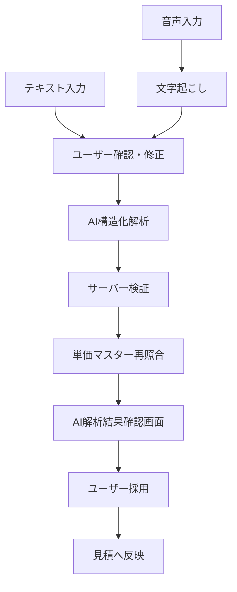

# 音声AI見積作成システム AI解析JSONスキーマ詳細設計書

## 1. 文書情報

| 項目 | 内容 |
| --- | --- |
| 文書名 | 音声AI見積作成システム AI解析JSONスキーマ詳細設計書 |
| 版数 | v0.1 |
| 作成日 | 2026-06-02 |
| 対象フェーズ | MVP詳細設計 |
| 関連資料 | `requirements.md`, `docs/11_api_selection_design.md`, `docs/15_api_detail_design.md` |

## 2. 目的

本書は、音声入力またはテキスト入力からAIが返す見積解析JSONの構造、意味、検証ルール、利用ルールを定義する。

AI解析結果はあくまで候補であり、ユーザーが確認・採用するまで見積データには反映しない。

## 3. 対象範囲

MVPの対象:

- 音声文字起こし後のテキスト解析
- 顧客候補の抽出
- 見積基本情報候補の抽出
- 見積明細候補の抽出
- 単価マスター候補の推測
- 不足情報、確認事項の抽出
- 顧客向け説明文案の生成
- 業者指示事項候補の抽出

対象外:

- 最終金額の確定
- 法的判断
- 契約条件の確定
- 顧客への自動送信
- 他会社データを使った推測
- 打ち合わせ録音オプションの長時間会話要約

## 4. 基本方針

- AI出力はJSON Schemaに準拠させる。
- スキーマは `schema_version` でバージョン管理する。
- AIは単価マスター候補を提示するが、最終採用はユーザーが行う。
- 単価と金額はサーバー側で再計算する。
- 業者指示事項は内部情報として扱い、顧客提出用PDFには渡さない。
- AIが不明な情報を推測で埋めない。不足情報は `missing_information` に出す。
- `tenant_id` はAIへ渡さず、サーバー側で管理する。

## 5. 処理フロー



## 6. トップレベル構造

AIは以下のトップレベルJSONを返す。

```json
{
  "schema_version": "1.0",
  "language": "ja",
  "summary": "外壁塗装の見積候補です。",
  "source_quality": {
    "transcript_confidence": 0.82,
    "has_noise": false,
    "ambiguous_phrases": []
  },
  "customer": {},
  "estimate": {},
  "line_candidates": [],
  "missing_information": [],
  "internal_vendor_instruction_candidates": [],
  "customer_note_draft": null,
  "assumptions": [],
  "warnings": []
}
```

| フィールド | 型 | 必須 | 説明 |
| --- | --- | --- | --- |
| `schema_version` | string | YES | スキーマバージョン。MVPは `1.0` |
| `language` | string | YES | 言語。日本語は `ja` |
| `summary` | string | YES | 入力内容の短い要約 |
| `source_quality` | object | YES | 入力音声またはテキストの品質情報 |
| `customer` | object/null | YES | 顧客候補 |
| `estimate` | object | YES | 見積基本情報候補 |
| `line_candidates` | array | YES | 見積明細候補 |
| `missing_information` | array | YES | 不足情報、確認事項 |
| `internal_vendor_instruction_candidates` | array | YES | 業者指示事項候補 |
| `customer_note_draft` | string/null | YES | 顧客向け備考文案 |
| `assumptions` | array | YES | AIが置いた仮定 |
| `warnings` | array | YES | 注意事項 |

## 7. source_quality

```json
{
  "transcript_confidence": 0.82,
  "has_noise": false,
  "ambiguous_phrases": [
    "百二十平米か百二十坪か不明"
  ]
}
```

| フィールド | 型 | 範囲 | 説明 |
| --- | --- | --- | --- |
| `transcript_confidence` | number/null | 0.0-1.0 | 文字起こし全体の信頼度 |
| `has_noise` | boolean |  | 雑音、聞き取り困難があるか |
| `ambiguous_phrases` | string[] |  | 曖昧な発話 |

UI表示:

- `has_noise = true` の場合、確認画面に「聞き取り不確実」バッジを表示する。
- `ambiguous_phrases` がある場合、確認事項に表示する。

## 8. customer

```json
{
  "name": "田中太郎",
  "name_kana": null,
  "contact_name": "田中様",
  "phone": null,
  "email": null,
  "address": "東京都...",
  "confidence": 0.72
}
```

| フィールド | 型 | 必須 | 説明 |
| --- | --- | --- | --- |
| `name` | string/null | YES | 顧客名候補 |
| `name_kana` | string/null | YES | 顧客名カナ候補 |
| `contact_name` | string/null | YES | 担当者名、呼称 |
| `phone` | string/null | YES | 電話番号候補 |
| `email` | string/null | YES | メール候補 |
| `address` | string/null | YES | 住所候補 |
| `confidence` | number | YES | 顧客情報抽出の信頼度 |

ルール:

- 顧客名が不明な場合は `null` にする。
- 既存顧客との照合はAIではなくサーバー側で行う。
- 顧客の新規作成はユーザー確認後に行う。

## 9. estimate

```json
{
  "title": "外壁塗装工事",
  "site_address": "東京都...",
  "desired_date": null,
  "estimate_date_hint": null,
  "expires_on_hint": null,
  "status_hint": "draft",
  "confidence": 0.78
}
```

| フィールド | 型 | 必須 | 説明 |
| --- | --- | --- | --- |
| `title` | string/null | YES | 件名候補 |
| `site_address` | string/null | YES | 現場住所候補 |
| `desired_date` | string/null | YES | 希望日、工期の候補 |
| `estimate_date_hint` | string/null | YES | 見積日候補。通常はnull |
| `expires_on_hint` | string/null | YES | 有効期限候補。通常はnull |
| `status_hint` | string | YES | 原則 `draft` |
| `confidence` | number | YES | 見積基本情報の信頼度 |

ルール:

- `status_hint` は原則 `draft` のみ。
- 日付が曖昧な場合は本文を `missing_information` に出す。
- AIが見積番号を作成しない。見積番号はサーバーが採番する。

## 10. line_candidates

見積明細候補を配列で返す。

```json
[
  {
    "candidate_id": "cand-001",
    "source_text": "外壁が120平米くらい",
    "location": "外壁",
    "item_name": "外壁塗装",
    "description": "外壁塗装 下塗り・上塗り",
    "quantity": 120,
    "unit": "m2",
    "line_type": "normal",
    "matched_price_item_candidates": [],
    "ai_suggested_unit_price": null,
    "customer_note": null,
    "internal_vendor_instruction": null,
    "confidence": 0.8,
    "needs_user_confirmation": false,
    "confirmation_reason": null
  }
]
```

| フィールド | 型 | 必須 | 説明 |
| --- | --- | --- | --- |
| `candidate_id` | string | YES | 候補ID。AIレスポンス内で一意 |
| `source_text` | string | YES | 根拠となる発話 |
| `location` | string/null | YES | 場所 |
| `item_name` | string | YES | 品目名候補 |
| `description` | string/null | YES | 明細説明 |
| `quantity` | number/null | YES | 数量 |
| `unit` | string/null | YES | 単位 |
| `line_type` | string | YES | `normal`, `discount`, `expense`, `note` |
| `matched_price_item_candidates` | array | YES | 単価マスター候補 |
| `ai_suggested_unit_price` | number/null | YES | AI参考単価。原則使用しない |
| `customer_note` | string/null | YES | 顧客向け明細備考 |
| `internal_vendor_instruction` | string/null | YES | 明細単位の業者指示事項候補 |
| `confidence` | number | YES | 明細候補の信頼度 |
| `needs_user_confirmation` | boolean | YES | ユーザー確認が必要か |
| `confirmation_reason` | string/null | YES | 確認が必要な理由 |

### 10.1 line_type

| 値 | 意味 |
| --- | --- |
| `normal` | 通常明細 |
| `discount` | 値引き |
| `expense` | 諸経費 |
| `note` | 金額なし注記 |

### 10.2 数量・単位ルール

- 数量が聞き取れない場合は `quantity = null`。
- 単位が聞き取れない場合は `unit = null`。
- 「一式」は `quantity = 1`, `unit = "式"` とする。
- 坪、平米、m2などは原文を尊重しつつ、可能なら `m2` など標準表記に正規化する。
- 単位変換が必要な場合は勝手に変換せず、`missing_information` に出す。

## 11. matched_price_item_candidates

単価マスター候補を返す。

```json
[
  {
    "price_item_id": "uuid",
    "name": "外壁塗装",
    "unit": "m2",
    "unit_price": 2500,
    "match_reason": "品目名と単位が一致",
    "confidence": 0.86
  }
]
```

| フィールド | 型 | 必須 | 説明 |
| --- | --- | --- | --- |
| `price_item_id` | string | YES | 単価マスターID |
| `name` | string | YES | 品目名 |
| `unit` | string | YES | 単位 |
| `unit_price` | number | YES | 単価 |
| `match_reason` | string | YES | 候補理由 |
| `confidence` | number | YES | 候補信頼度 |

重要ルール:

- AIに渡す単価候補は、必ず同一会社の単価マスターに限定する。
- AIが返した `price_item_id` はサーバー側で再検証する。
- `price_item_id` が存在しない、他会社、無効品目の場合は候補から除外する。
- 候補は最大5件を目安とする。

## 12. missing_information

不足情報や確認事項を返す。

```json
[
  {
    "id": "miss-001",
    "field": "paint_grade",
    "scope": "estimate",
    "line_candidate_id": null,
    "question": "使用する塗料グレードを確認してください。",
    "severity": "warning",
    "suggested_choices": [
      "シリコン",
      "フッ素",
      "無機"
    ]
  }
]
```

| フィールド | 型 | 必須 | 説明 |
| --- | --- | --- | --- |
| `id` | string | YES | 確認事項ID |
| `field` | string | YES | 対象フィールド |
| `scope` | string | YES | `estimate`, `line`, `customer` |
| `line_candidate_id` | string/null | YES | 明細候補に紐づく場合のID |
| `question` | string | YES | ユーザーへ表示する質問 |
| `severity` | string | YES | `info`, `warning`, `blocking` |
| `suggested_choices` | string[] | YES | 選択肢候補 |

### severity

| 値 | UI/動作 |
| --- | --- |
| `info` | 補足確認。下書き作成可 |
| `warning` | 確認推奨。下書き作成可 |
| `blocking` | そのままでは確定不可。ユーザー入力が必要 |

## 13. internal_vendor_instruction_candidates

業者指示事項候補を返す。

```json
[
  {
    "id": "inst-001",
    "scope": "line",
    "line_candidate_id": "cand-001",
    "text": "高圧洗浄時に隣接駐車場への飛散養生を確認する。",
    "source_text": "隣の駐車場が近い",
    "confidence": 0.74
  }
]
```

| フィールド | 型 | 必須 | 説明 |
| --- | --- | --- | --- |
| `id` | string | YES | 候補ID |
| `scope` | string | YES | `estimate`, `line` |
| `line_candidate_id` | string/null | YES | 明細候補に紐づく場合のID |
| `text` | string | YES | 業者指示事項候補 |
| `source_text` | string | YES | 根拠となる発話 |
| `confidence` | number | YES | 信頼度 |

重要ルール:

- 業者指示事項は内部情報である。
- 顧客向けPDFには絶対に出力しない。
- AI解析結果確認画面では「内部用」「PDF非表示」と明示する。
- ユーザーが採用した場合のみ、`estimates.internal_vendor_instruction` または `estimate_lines.internal_vendor_instruction` に保存する。

## 14. customer_note_draft

顧客向け備考の文案を返す。

```json
"外壁塗装工事一式のお見積りです。現地確認内容に基づき、足場、高圧洗浄、塗装作業を含めています。"
```

ルール:

- 顧客向けにそのまま表示される可能性があるため、丁寧な文体にする。
- 業者指示事項、内部事情、原価、粗利は含めない。
- 法的・契約的に断定しすぎる表現を避ける。
- ユーザー編集後にのみ見積へ反映する。

## 15. assumptions

AIが置いた仮定を返す。

```json
[
  "外壁面積は発話内容の120m2を使用しています。",
  "塗料グレードは未確認のため見積明細には反映していません。"
]
```

ルール:

- 仮定を隠さない。
- 金額や数量に影響する仮定は `missing_information` にも出す。

## 16. warnings

注意事項を返す。

```json
[
  {
    "code": "LOW_CONFIDENCE_QUANTITY",
    "message": "数量の聞き取り信頼度が低い明細があります。",
    "severity": "warning"
  }
]
```

| フィールド | 型 | 必須 | 説明 |
| --- | --- | --- | --- |
| `code` | string | YES | 警告コード |
| `message` | string | YES | 表示メッセージ |
| `severity` | string | YES | `info`, `warning`, `blocking` |

## 17. JSON Schema v1.0

MVPで使用するJSON Schema。

```json
{
  "$schema": "https://json-schema.org/draft/2020-12/schema",
  "$id": "https://mitsumori.example.com/schemas/estimate-ai-extraction-1.0.json",
  "title": "EstimateAIExtraction",
  "type": "object",
  "additionalProperties": false,
  "required": [
    "schema_version",
    "language",
    "summary",
    "source_quality",
    "customer",
    "estimate",
    "line_candidates",
    "missing_information",
    "internal_vendor_instruction_candidates",
    "customer_note_draft",
    "assumptions",
    "warnings"
  ],
  "properties": {
    "schema_version": {
      "const": "1.0"
    },
    "language": {
      "type": "string",
      "enum": ["ja"]
    },
    "summary": {
      "type": "string",
      "maxLength": 1000
    },
    "source_quality": {
      "type": "object",
      "additionalProperties": false,
      "required": ["transcript_confidence", "has_noise", "ambiguous_phrases"],
      "properties": {
        "transcript_confidence": {
          "type": ["number", "null"],
          "minimum": 0,
          "maximum": 1
        },
        "has_noise": {
          "type": "boolean"
        },
        "ambiguous_phrases": {
          "type": "array",
          "items": {
            "type": "string",
            "maxLength": 500
          }
        }
      }
    },
    "customer": {
      "type": ["object", "null"],
      "additionalProperties": false,
      "required": ["name", "name_kana", "contact_name", "phone", "email", "address", "confidence"],
      "properties": {
        "name": { "type": ["string", "null"], "maxLength": 255 },
        "name_kana": { "type": ["string", "null"], "maxLength": 255 },
        "contact_name": { "type": ["string", "null"], "maxLength": 255 },
        "phone": { "type": ["string", "null"], "maxLength": 50 },
        "email": { "type": ["string", "null"], "maxLength": 255 },
        "address": { "type": ["string", "null"], "maxLength": 2000 },
        "confidence": { "type": "number", "minimum": 0, "maximum": 1 }
      }
    },
    "estimate": {
      "type": "object",
      "additionalProperties": false,
      "required": ["title", "site_address", "desired_date", "estimate_date_hint", "expires_on_hint", "status_hint", "confidence"],
      "properties": {
        "title": { "type": ["string", "null"], "maxLength": 255 },
        "site_address": { "type": ["string", "null"], "maxLength": 2000 },
        "desired_date": { "type": ["string", "null"], "maxLength": 255 },
        "estimate_date_hint": { "type": ["string", "null"], "maxLength": 50 },
        "expires_on_hint": { "type": ["string", "null"], "maxLength": 50 },
        "status_hint": { "type": "string", "enum": ["draft"] },
        "confidence": { "type": "number", "minimum": 0, "maximum": 1 }
      }
    },
    "line_candidates": {
      "type": "array",
      "maxItems": 100,
      "items": {
        "$ref": "#/$defs/lineCandidate"
      }
    },
    "missing_information": {
      "type": "array",
      "maxItems": 100,
      "items": {
        "$ref": "#/$defs/missingInformation"
      }
    },
    "internal_vendor_instruction_candidates": {
      "type": "array",
      "maxItems": 100,
      "items": {
        "$ref": "#/$defs/internalVendorInstructionCandidate"
      }
    },
    "customer_note_draft": {
      "type": ["string", "null"],
      "maxLength": 3000
    },
    "assumptions": {
      "type": "array",
      "items": {
        "type": "string",
        "maxLength": 1000
      }
    },
    "warnings": {
      "type": "array",
      "items": {
        "$ref": "#/$defs/warning"
      }
    }
  },
  "$defs": {
    "lineCandidate": {
      "type": "object",
      "additionalProperties": false,
      "required": [
        "candidate_id",
        "source_text",
        "location",
        "item_name",
        "description",
        "quantity",
        "unit",
        "line_type",
        "matched_price_item_candidates",
        "ai_suggested_unit_price",
        "customer_note",
        "internal_vendor_instruction",
        "confidence",
        "needs_user_confirmation",
        "confirmation_reason"
      ],
      "properties": {
        "candidate_id": { "type": "string", "maxLength": 100 },
        "source_text": { "type": "string", "maxLength": 1000 },
        "location": { "type": ["string", "null"], "maxLength": 255 },
        "item_name": { "type": "string", "maxLength": 255 },
        "description": { "type": ["string", "null"], "maxLength": 2000 },
        "quantity": { "type": ["number", "null"], "minimum": 0 },
        "unit": { "type": ["string", "null"], "maxLength": 50 },
        "line_type": { "type": "string", "enum": ["normal", "discount", "expense", "note"] },
        "matched_price_item_candidates": {
          "type": "array",
          "maxItems": 5,
          "items": { "$ref": "#/$defs/priceItemCandidate" }
        },
        "ai_suggested_unit_price": { "type": ["number", "null"], "minimum": 0 },
        "customer_note": { "type": ["string", "null"], "maxLength": 2000 },
        "internal_vendor_instruction": { "type": ["string", "null"], "maxLength": 2000 },
        "confidence": { "type": "number", "minimum": 0, "maximum": 1 },
        "needs_user_confirmation": { "type": "boolean" },
        "confirmation_reason": { "type": ["string", "null"], "maxLength": 1000 }
      }
    },
    "priceItemCandidate": {
      "type": "object",
      "additionalProperties": false,
      "required": ["price_item_id", "name", "unit", "unit_price", "match_reason", "confidence"],
      "properties": {
        "price_item_id": { "type": "string", "format": "uuid" },
        "name": { "type": "string", "maxLength": 255 },
        "unit": { "type": "string", "maxLength": 50 },
        "unit_price": { "type": "number", "minimum": 0 },
        "match_reason": { "type": "string", "maxLength": 1000 },
        "confidence": { "type": "number", "minimum": 0, "maximum": 1 }
      }
    },
    "missingInformation": {
      "type": "object",
      "additionalProperties": false,
      "required": ["id", "field", "scope", "line_candidate_id", "question", "severity", "suggested_choices"],
      "properties": {
        "id": { "type": "string", "maxLength": 100 },
        "field": { "type": "string", "maxLength": 100 },
        "scope": { "type": "string", "enum": ["estimate", "line", "customer"] },
        "line_candidate_id": { "type": ["string", "null"], "maxLength": 100 },
        "question": { "type": "string", "maxLength": 1000 },
        "severity": { "type": "string", "enum": ["info", "warning", "blocking"] },
        "suggested_choices": {
          "type": "array",
          "maxItems": 20,
          "items": { "type": "string", "maxLength": 255 }
        }
      }
    },
    "internalVendorInstructionCandidate": {
      "type": "object",
      "additionalProperties": false,
      "required": ["id", "scope", "line_candidate_id", "text", "source_text", "confidence"],
      "properties": {
        "id": { "type": "string", "maxLength": 100 },
        "scope": { "type": "string", "enum": ["estimate", "line"] },
        "line_candidate_id": { "type": ["string", "null"], "maxLength": 100 },
        "text": { "type": "string", "maxLength": 2000 },
        "source_text": { "type": "string", "maxLength": 1000 },
        "confidence": { "type": "number", "minimum": 0, "maximum": 1 }
      }
    },
    "warning": {
      "type": "object",
      "additionalProperties": false,
      "required": ["code", "message", "severity"],
      "properties": {
        "code": { "type": "string", "maxLength": 100 },
        "message": { "type": "string", "maxLength": 1000 },
        "severity": { "type": "string", "enum": ["info", "warning", "blocking"] }
      }
    }
  }
}
```

## 18. サンプルレスポンス

```json
{
  "schema_version": "1.0",
  "language": "ja",
  "summary": "田中様宅の外壁塗装について、外壁120m2、足場、高圧洗浄を含む見積候補です。",
  "source_quality": {
    "transcript_confidence": 0.84,
    "has_noise": false,
    "ambiguous_phrases": []
  },
  "customer": {
    "name": "田中太郎",
    "name_kana": null,
    "contact_name": "田中様",
    "phone": null,
    "email": null,
    "address": null,
    "confidence": 0.74
  },
  "estimate": {
    "title": "外壁塗装工事",
    "site_address": null,
    "desired_date": null,
    "estimate_date_hint": null,
    "expires_on_hint": null,
    "status_hint": "draft",
    "confidence": 0.82
  },
  "line_candidates": [
    {
      "candidate_id": "cand-001",
      "source_text": "外壁が120平米くらい",
      "location": "外壁",
      "item_name": "外壁塗装",
      "description": "外壁塗装",
      "quantity": 120,
      "unit": "m2",
      "line_type": "normal",
      "matched_price_item_candidates": [
        {
          "price_item_id": "11111111-1111-1111-1111-111111111111",
          "name": "外壁塗装",
          "unit": "m2",
          "unit_price": 2500,
          "match_reason": "品目名と単位が一致",
          "confidence": 0.86
        }
      ],
      "ai_suggested_unit_price": null,
      "customer_note": null,
      "internal_vendor_instruction": null,
      "confidence": 0.82,
      "needs_user_confirmation": false,
      "confirmation_reason": null
    },
    {
      "candidate_id": "cand-002",
      "source_text": "足場と高圧洗浄も入れて",
      "location": "外部",
      "item_name": "足場",
      "description": "仮設足場",
      "quantity": null,
      "unit": "式",
      "line_type": "normal",
      "matched_price_item_candidates": [],
      "ai_suggested_unit_price": null,
      "customer_note": null,
      "internal_vendor_instruction": "足場設置時に隣地境界を確認する。",
      "confidence": 0.68,
      "needs_user_confirmation": true,
      "confirmation_reason": "足場の数量が不明です。"
    }
  ],
  "missing_information": [
    {
      "id": "miss-001",
      "field": "quantity",
      "scope": "line",
      "line_candidate_id": "cand-002",
      "question": "足場の数量または一式金額を確認してください。",
      "severity": "warning",
      "suggested_choices": []
    }
  ],
  "internal_vendor_instruction_candidates": [
    {
      "id": "inst-001",
      "scope": "line",
      "line_candidate_id": "cand-002",
      "text": "足場設置時に隣地境界を確認する。",
      "source_text": "隣が近いから注意",
      "confidence": 0.72
    }
  ],
  "customer_note_draft": "外壁塗装工事について、外壁塗装、足場、高圧洗浄を含めたお見積りです。",
  "assumptions": [
    "外壁面積は発話内容の120m2を使用しています。"
  ],
  "warnings": [
    {
      "code": "MISSING_LINE_QUANTITY",
      "message": "数量が未確定の明細があります。",
      "severity": "warning"
    }
  ]
}
```

## 19. サーバー側検証ルール

AIレスポンス受信後、サーバー側で以下を検証する。

1. JSON Schemaに準拠していること。
2. `schema_version` が対応バージョンであること。
3. `candidate_id` がレスポンス内で重複していないこと。
4. `line_candidate_id` が存在する候補を参照していること。
5. `matched_price_item_candidates.price_item_id` が同一会社の有効な単価マスターであること。
6. `unit_price` はサーバー側の単価マスター値を正とすること。
7. `quantity`, `unit_price`, `amount` はサーバー側で再計算すること。
8. `internal_vendor_instruction` は顧客向けDTOに渡さないこと。
9. 長すぎる文字列は保存前にエラーまたは切り詰め確認を行うこと。
10. `blocking` の確認事項がある場合は、見積への確定反映を止めること。

## 20. 単価マスター候補生成ルール

AI解析前後で以下の2段階照合を行う。

### 20.1 AI入力前

サーバーはログイン中の会社の単価マスターから、入力テキストと近い候補だけを抽出してAIへ渡す。

候補抽出条件:

- 品目名の部分一致
- 単位の一致
- かな、漢字、表記揺れを考慮した簡易正規化
- 有効品目のみ

### 20.2 AI出力後

AIが返した候補をサーバー側で再検証する。

- 存在しない `price_item_id` は除外。
- 他会社の `price_item_id` は除外。
- 無効品目は除外。
- 単価はDB値で上書き。
- 候補が0件の場合、手入力品目として表示。

## 21. UI反映ルール

AI解析結果確認画面では以下の表示にする。

| JSON項目 | UI表示 |
| --- | --- |
| `summary` | 解析概要 |
| `line_candidates` | 明細候補カードまたは表 |
| `matched_price_item_candidates` | 単価マスター候補の選択肢 |
| `missing_information` | 確認事項リスト |
| `internal_vendor_instruction_candidates` | 内部用・PDF非表示の指示候補 |
| `customer_note_draft` | 顧客向け備考案 |
| `warnings` | 警告バナー |

採用ルール:

- 明細候補はユーザーが選択したものだけ見積に反映する。
- 単価マスター候補はユーザーが選択する。
- 業者指示事項候補は初期状態では未採用にする。
- `needs_user_confirmation = true` の候補は確認済みになるまで強調表示する。
- `severity = blocking` の確認事項がある場合は「見積へ反映」ボタンを無効にする。

## 22. AIプロンプト制約

システムプロンプトに含めるべき制約:

- 必ず指定JSON Schemaに従う。
- 不明な項目は推測で埋めず `null` にする。
- 不足情報は `missing_information` に出す。
- 金額は最終確定しない。
- 単価は候補として扱う。
- 顧客向け備考に内部情報、業者指示、原価、粗利を含めない。
- 業者指示事項は `internal_vendor_instruction_candidates` または明細の `internal_vendor_instruction` に分離する。
- 顧客向けPDFに出すべきでない内容は、顧客向け文案に混ぜない。
- 同一の作業を重複して明細化しない。
- 数量や単位が不明な場合は確認事項にする。

## 23. 保存方針

`ai_analysis_runs.extraction_json` に以下を保存する。

- AIの生JSON
- サーバー検証後の正規化JSON
- スキーマバージョン
- 検証結果

MVPでは1つの `extraction_json` に保存してよいが、将来は以下に分けることを検討する。

- `raw_extraction_json`
- `validated_extraction_json`
- `validation_errors`

## 24. 受入基準

- AIレスポンスがJSON Schemaに準拠している。
- 必須項目が欠けている場合は保存せずエラーにする。
- 他会社の単価マスターIDが混入してもサーバー側で除外する。
- AIが返した単価はDB単価で再検証される。
- AI解析結果はユーザーが採用するまで見積に反映されない。
- 業者指示事項候補は顧客向けPDF DTOに含まれない。
- `blocking` の確認事項がある場合、見積への反映が止まる。
- サンプル音声から、場所、品目、数量、単位、備考、業者指示事項候補を抽出できる。

## 25. 今後の拡張

| 項目 | 内容 |
| --- | --- |
| 打ち合わせ録音オプション | 長時間会話用の要約スキーマを別途定義する |
| 画像・図面解析 | `input_type = image`, `drawing` に対応する |
| 業種別スキーマ | 外壁塗装、水道修理、電気工事などで確認項目を切り替える |
| 類似見積検索 | 過去見積候補をAI入力に加える。ただし会社単位の分離を必須とする |
| OpenAPI連携 | API仕様とJSON Schemaを型生成に利用する |

