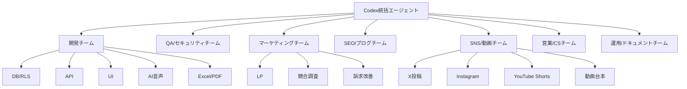

# 音声AI見積作成システム Codex最大活用構成書

## 1. 目的

本書は、Codexを単なる開発補助ではなく、開発・QA・SEO・SNS・動画・営業・運用を並列で進める実働チームとして使うための構成を定義する。

本プロジェクトの最終目的は、以下を同時に進めることである。

| 目的 | 内容 |
| --- | --- |
| MVP完成 | 音声AI見積作成システムを実際に触れる状態まで作る |
| 品質担保 | 会社別データ分離、RLS、帳票出力、AI制御のバグを潰す |
| 集客準備 | LP、SEO記事、SNS、動画、営業資料を整備する |
| 商談準備 | デモ台本、提案資料、問い合わせ対応を準備する |
| 継続運用 | 週次で開発・集客・改善を回せる体制にする |

## 2. 全体構成

Codexを中心に、以下の7チーム構成で運用する。



## 3. Codex統括エージェント

### 役割

全体の司令塔として、タスクを分解し、各エージェントに渡し、成果物を統合する。

### 主な仕事

| 項目 | 内容 |
| --- | --- |
| タスク分解 | 要件を実装・検証・集客タスクへ分ける |
| 優先順位付け | P0/P1/P2で実行順を決める |
| 並列化 | 独立した作業を複数エージェントに割り振る |
| 成果物管理 | docs、web、marketing、blog_articlesを整理する |
| 最終判断 | 実装済み、要修正、保留を判定する |

### 統括エージェントへの基本指示

```text
あなたは音声AI見積作成システムのプロジェクト統括です。
docs配下の要件・DB・API・QA・MVP資料を読み、
開発、QA、SEO、SNS、動画、営業資料のタスクを分解してください。
各タスクは成果物、担当、依存関係、完了条件を明確にしてください。
```

## 4. 開発チーム構成

### 4.1 DB/RLSエージェント

| 項目 | 内容 |
| --- | --- |
| 目的 | 会社別データ分離を壊さないDBを作る |
| 対象 | Supabase Postgres、RLS、tenant_id、監査ログ |
| 参照資料 | `docs/10_database_security_design.md`, `docs/14_database_detail_design.md` |
| 成果物 | migration SQL、RLS policy、テストSQL |
| 最重要条件 | 他会社データが見えないこと |

実行タスク:

- tenants/users/customers/price_items/estimates/estimate_linesの実装
- files/import_jobs/export_jobs/ai_analysis_runsの実装
- RLSポリシー作成
- tenant_idをクライアントから受け取らない設計確認
- 管理者/member権限制御
- RLSテストケース作成

### 4.2 APIエージェント

| 項目 | 内容 |
| --- | --- |
| 目的 | 画面とDBをつなぐ安全なAPIを作る |
| 対象 | Next.js API、認証、業務ロジック |
| 参照資料 | `docs/15_api_detail_design.md` |
| 成果物 | API route、validation、error response |

実行タスク:

- 顧客CRUD
- 単価マスターCRUD
- 見積ヘッダCRUD
- 見積明細CRUD
- 明細並び順保存
- 小計・税額・合計計算
- Excel取込ジョブ管理
- Excel/PDF出力ジョブ管理

### 4.3 UI/UXエージェント

| 項目 | 内容 |
| --- | --- |
| 目的 | スマホで現場担当者が使える画面を作る |
| 対象 | Next.js UI、見積編集、音声入力、確認画面 |
| 参照資料 | `docs/03_ui_ux_design.md`, `docs/09_wireframes.md`, `docs/12_claude_code_uiux_handoff.md` |
| 成果物 | 画面実装、状態管理、レスポンシブ確認 |

実行タスク:

- 見積一覧
- 見積編集
- 顧客選択
- 明細追加・編集・削除
- ドラッグアンドドロップ並び替え
- AI候補確認画面
- 単価マスター取込画面
- Excel/PDF出力画面

### 4.4 AI音声エージェント

| 項目 | 内容 |
| --- | --- |
| 目的 | 音声から見積明細候補を作る |
| 対象 | 音声入力、文字起こし、AI JSON、単価照合 |
| 参照資料 | `docs/16_ai_json_schema_design.md`, `docs/11_api_selection_design.md` |
| 成果物 | AI prompt、JSON schema、候補生成ロジック |

重要ルール:

- 顧客情報、見積日、有効期限、担当者はAIで入力しない
- AIは見積明細候補だけを作る
- 単位はAIが判断せず、単価マスターの単位を使う
- AI結果はユーザー確認後にのみ見積へ反映する

### 4.5 Excel/PDFエージェント

| 項目 | 内容 |
| --- | --- |
| 目的 | 既存Excel資産を活かし、帳票出力まで行う |
| 対象 | 単価マスターExcel取込、見積Excel出力、PDF出力 |
| 成果物 | 取込処理、帳票テンプレート、出力テスト |

実行タスク:

- 単価マスターExcel列マッピング
- 取込プレビュー
- エラー行表示
- 見積Excel出力
- 顧客向けPDF出力
- 業者指示事項の出力分離

## 5. QA/セキュリティチーム構成

### 役割

開発チームとは別に、バグ・セキュリティ・仕様漏れを検出する。

### 担当領域

| 領域 | チェック内容 |
| --- | --- |
| RLS | 他会社データにアクセスできない |
| 権限 | admin/memberの操作範囲が正しい |
| AI | ヘッダ情報をAIが入力しない |
| 単価 | 単位をAIが推測しない |
| 帳票 | PDFには業者指示事項を出さない |
| Excel | Excelには業者指示事項を含める |
| UI | スマホで文字崩れ・操作不能がない |
| 性能 | 100明細程度で大きく遅くならない |

### QAエージェントへの基本指示

```text
あなたはQA/バグチェック担当です。
実装済みのコードと docs/06_qa_test_plan.md を確認し、
仕様違反、セキュリティリスク、データ漏えい、帳票出力ミスを優先して検出してください。
指摘はファイル名、該当箇所、再現手順、期待動作、修正案をセットで出してください。
```

## 6. マーケティングチーム構成

### 6.1 マーケットエージェント

| 項目 | 内容 |
| --- | --- |
| 目的 | 勝てる市場ポジションを作る |
| 対象 | 競合、ターゲット、訴求、価格、導入理由 |
| 成果物 | 競合比較、訴求軸、LP改善案、営業メッセージ |

担当タスク:

- 建設業向け見積システムの競合整理
- 音声AI見積の差別化ポイント作成
- iudake等の類似サービスとの比較
- 勝つための機能一覧
- LPファーストビュー改善案
- 料金プラン案
- ターゲット業種ごとの訴求整理

### 6.2 LP改善エージェント

| 項目 | 内容 |
| --- | --- |
| 目的 | 問い合わせにつながるLPにする |
| 対象 | `/lp` |
| 成果物 | LP改善、CTA、FAQ、OGP、構造化データ |

担当タスク:

- ファーストビュー改善
- CTA文言改善
- よくある不安への回答追加
- 導入事例風セクション追加
- 料金・デモ案内の整理
- SEO title/description改善

## 7. SEO/ブログチーム構成

### 目的

検索流入を取り、LPへ送客する。

### キーワード群

| 種別 | キーワード |
| --- | --- |
| メイン | 建設業 見積 AI |
| 音声 | 音声入力 見積 作成 |
| Excel | 単価マスター Excel 取り込み |
| 業種 | 外壁塗装 見積 AI、リフォーム 見積 DX |
| 連携 | 見積 データ連携 建設業 |
| 課題 | 見積作成 時間短縮、見積ミス 防止 |

### 記事クラスタ

| クラスタ | 記事例 | CTA |
| --- | --- | --- |
| AI見積 | 建設業向けAI見積とは | LPへ誘導 |
| 音声入力 | 音声入力で見積作成する方法 | デモへ誘導 |
| Excel取込 | 単価マスターExcel取込の方法 | 資料請求へ誘導 |
| データ連携 | 建設業システムと見積データ連携 | 商談へ誘導 |
| 業務改善 | 見積DXの進め方 | LPへ誘導 |

### SEOエージェントへの基本指示

```text
あなたはSEO担当です。
音声AI見積作成システムのLPへ問い合わせを集める目的で、
キーワード設計、記事構成、内部リンク、CTA、FAQ、構造化データを作成してください。
記事は建設業の経営者・営業担当者が自然に読める文体にしてください。
```

## 8. SNS/動画チーム構成

### 8.1 SNSエージェント

| 媒体 | 役割 | 投稿内容 |
| --- | --- | --- |
| X | 認知獲得 | 見積あるある、開発進捗、短いTips |
| Instagram | 視覚訴求 | カルーセル、見積ミス防止、導入メリット |
| YouTube Shorts | 動画集客 | 現場から見積作成までの短尺動画 |
| TikTok | ライト層認知 | 現場あるある、AIで変わる業務 |
| LinkedIn | BtoB信頼 | DX、業務効率化、開発ロードマップ |

### 8.2 動画エージェント

Codexは動画ファイルを直接作るのではなく、動画制作の設計を担当する。

成果物:

- 15秒動画台本
- 30秒サービス紹介台本
- 60秒デモ動画台本
- ナレーション原稿
- テロップ原稿
- カット割り
- 絵コンテ
- Sora等の動画生成AI向けプロンプト
- サムネイル案
- 投稿文

### 動画シリーズ案

| No | タイトル | 尺 | 目的 |
| --- | --- | --- | --- |
| 1 | 現場で話すだけで見積明細に | 15秒 | LP誘導 |
| 2 | 見積作成が遅れる3つの原因 | 30秒 | 課題喚起 |
| 3 | 単価マスターExcelをAI見積に使う | 30秒 | 機能理解 |
| 4 | 業者指示事項を顧客に出さない設計 | 30秒 | 不安解消 |
| 5 | 建設業の見積DXは何から始めるか | 60秒 | 教育コンテンツ |

## 9. 営業/CSチーム構成

### 営業エージェント

| 成果物 | 内容 |
| --- | --- |
| 営業資料 | 課題、解決策、機能、導入効果 |
| デモ台本 | 5分、15分、30分の商談シナリオ |
| ヒアリングシート | 現在の見積作成方法、単価表、帳票形式 |
| 反論対応集 | AI不安、価格、導入手間、現場定着 |
| メール文 | 初回営業、フォロー、デモ案内 |
| 導入チェックリスト | 顧客、単価、帳票、権限、出力形式 |

### 顧客対応エージェント

担当タスク:

- 問い合わせ返信テンプレート
- 初回ヒアリング項目
- デモ後フォローメール
- 導入前FAQ
- 操作マニュアル
- 既存Excel単価表の確認手順

## 10. 運用/ドキュメントチーム構成

### 役割

プロジェクトが属人化しないように、全成果物を整理する。

### 管理フォルダ

| フォルダ | 用途 |
| --- | --- |
| `docs/` | 要件、設計、QA、実装計画 |
| `web/` | Next.jsアプリ本体 |
| `marketing/` | LP、営業、SNS、プレス資料 |
| `blog_articles/` | SEO記事原稿 |
| `web/public/` | OG画像、公開素材 |

### 作るべき運用資料

- 週次タスク表
- バグ管理表
- リリースチェックリスト
- Search Console登録手順
- SNS投稿カレンダー
- 動画制作カレンダー
- 商談ログテンプレート

## 11. 30日間の最強運用スケジュール

### Week 1: プロダクト基盤

| 日 | 作業 |
| --- | --- |
| Day 1 | Supabase/RLS方針確認、DB migration作成 |
| Day 2 | 認証、会社別データ分離、権限 |
| Day 3 | 顧客マスター、単価マスター |
| Day 4 | 単価マスターExcel取込 |
| Day 5 | 見積ヘッダ、見積明細 |
| Day 6 | QA、RLSテスト |
| Day 7 | 振り返り、次週計画 |

### Week 2: 見積作成体験

| 日 | 作業 |
| --- | --- |
| Day 8 | 見積編集UI |
| Day 9 | 明細ドラッグ並び替え |
| Day 10 | 合計計算、税計算 |
| Day 11 | Excel出力 |
| Day 12 | PDF出力 |
| Day 13 | 帳票QA |
| Day 14 | デモシナリオ作成 |

### Week 3: AIと集客

| 日 | 作業 |
| --- | --- |
| Day 15 | 音声入力UI |
| Day 16 | 文字起こしAPI |
| Day 17 | AI明細候補生成 |
| Day 18 | 単価マスター照合 |
| Day 19 | AI候補確認画面 |
| Day 20 | LP改善、SEO確認 |
| Day 21 | ブログ記事追加 |

### Week 4: 売れる形へ仕上げる

| 日 | 作業 |
| --- | --- |
| Day 22 | SNS投稿30本作成 |
| Day 23 | 動画台本10本作成 |
| Day 24 | 営業資料作成 |
| Day 25 | デモ台本作成 |
| Day 26 | 本番デプロイ確認 |
| Day 27 | Search Console登録 |
| Day 28 | 初期顧客候補リスト作成 |
| Day 29 | 総合QA |
| Day 30 | リリース判定 |

## 12. クレジット配分

100ドル分の追加クレジットを使う場合、以下の配分を推奨する。

| 領域 | 配分 | 使い方 |
| --- | ---: | --- |
| MVP実装 | 55% | DB、API、UI、AI、Excel/PDF |
| QA/セキュリティ | 15% | RLS、E2E、帳票、AI制御 |
| SEO/LP/ブログ | 15% | LP改善、記事、構造化データ |
| SNS/動画 | 10% | 投稿、動画台本、サムネイル案 |
| 営業/資料 | 5% | 提案書、デモ台本、メール |

## 13. 毎日の運用ルール

### 朝

- 前日の成果物を確認
- 今日のP0タスクを3つだけ決める
- 並列化できる作業をサブエージェントへ渡す

### 日中

- Codexに実装を任せる
- QAエージェントに別視点で確認させる
- マーケエージェントに集客素材を作らせる

### 夜

- 変更ファイル一覧を確認
- ビルド/テスト結果を確認
- 翌日のタスクへ分解

## 14. 依頼テンプレート

### 開発依頼

```text
docsの要件とDB/API設計を読み、
対象機能を実装してください。
変更ファイル、実装内容、テスト結果、残課題を最後にまとめてください。
既存の仕様と違う判断をした場合は理由を書いてください。
```

### QA依頼

```text
この機能をレビューしてください。
優先して見る観点は、会社別データ分離、権限、AI制御、帳票出力、入力バリデーションです。
重大度順に、ファイル名、再現手順、期待動作、修正案を出してください。
```

### SEO依頼

```text
LPへ問い合わせを集める目的で、指定キーワードの記事を作ってください。
タイトル、description、H2構成、FAQ、内部リンク、CTAを含めてください。
読者は建設業の経営者または営業担当者です。
```

### SNS依頼

```text
音声AI見積作成システムのSNS投稿を作ってください。
媒体はX、Instagram、YouTube Shortsです。
投稿目的、本文、ハッシュタグ、LPへの誘導文をセットで出してください。
```

### 動画依頼

```text
音声AI見積作成システムの30秒動画台本を作ってください。
カット割り、画面内容、ナレーション、テロップ、BGM雰囲気、最後のCTAを含めてください。
Sora等の動画生成AIに渡すプロンプトも作ってください。
```

## 15. 最初に実行するべき5タスク

今すぐ始めるなら、以下の順番で進める。

| 優先 | タスク | 理由 |
| --- | --- | --- |
| 1 | Vercel本番へSEO反映 | LPを検索対象にするため |
| 2 | ブログ5本をアプリの `/blog` に掲載 | SEO導線を作るため |
| 3 | Supabase DB/RLS実装 | プロダクトの土台になるため |
| 4 | 単価マスターExcel取込実装 | 差別化機能になるため |
| 5 | 営業用デモ台本作成 | 初期顧客へ説明しやすくするため |

## 16. 成功条件

| 領域 | 成功条件 |
| --- | --- |
| 開発 | 見積作成からExcel/PDF出力まで通る |
| セキュリティ | 他会社データが見えない |
| AI | 明細候補だけを作り、ヘッダ情報を触らない |
| SEO | LP、ブログ、sitemap、robots、構造化データが本番反映される |
| SNS | 30日分の投稿が準備される |
| 動画 | 10本分の台本と生成プロンプトが準備される |
| 営業 | デモ台本、提案資料、FAQ、返信テンプレートが揃う |

## 17. 結論

このプロジェクトでCodexを最大活用するには、開発だけに使わない。

最も強い使い方は、Codexを以下のように使うことである。

- 開発者としてMVPを作る
- QA担当としてバグを潰す
- SEO担当として流入を作る
- SNS担当として認知を作る
- 動画担当として短尺コンテンツを量産する
- 営業担当として商談資料を作る
- PMとして全体を毎日整理する

つまり、Codexを「1人の開発補助」ではなく、「小さな事業開発チーム」として運用する。
